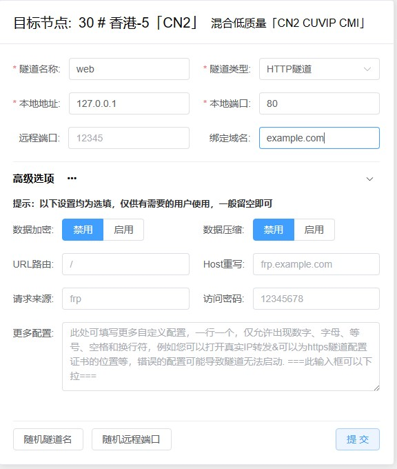
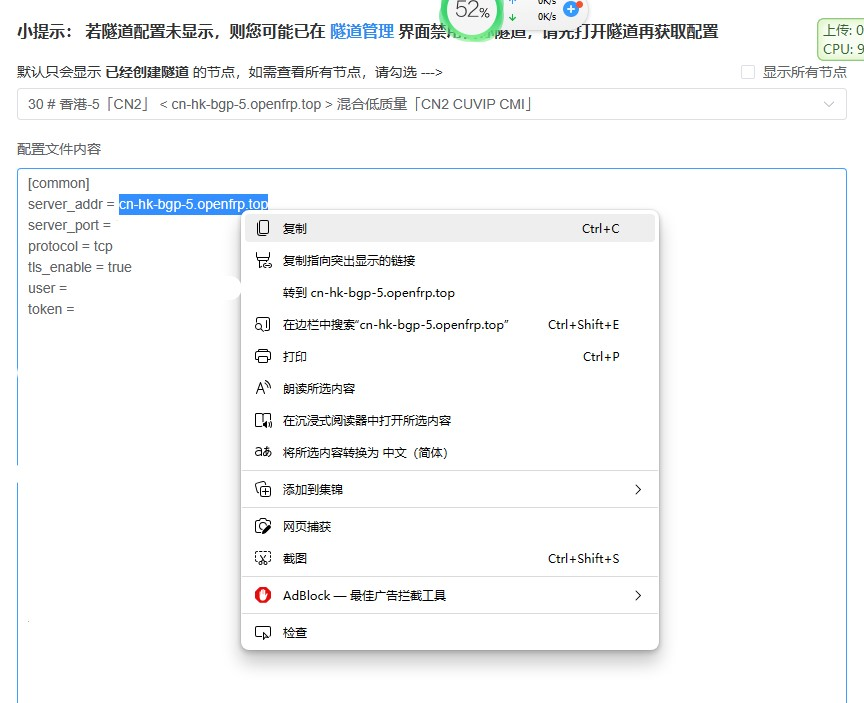
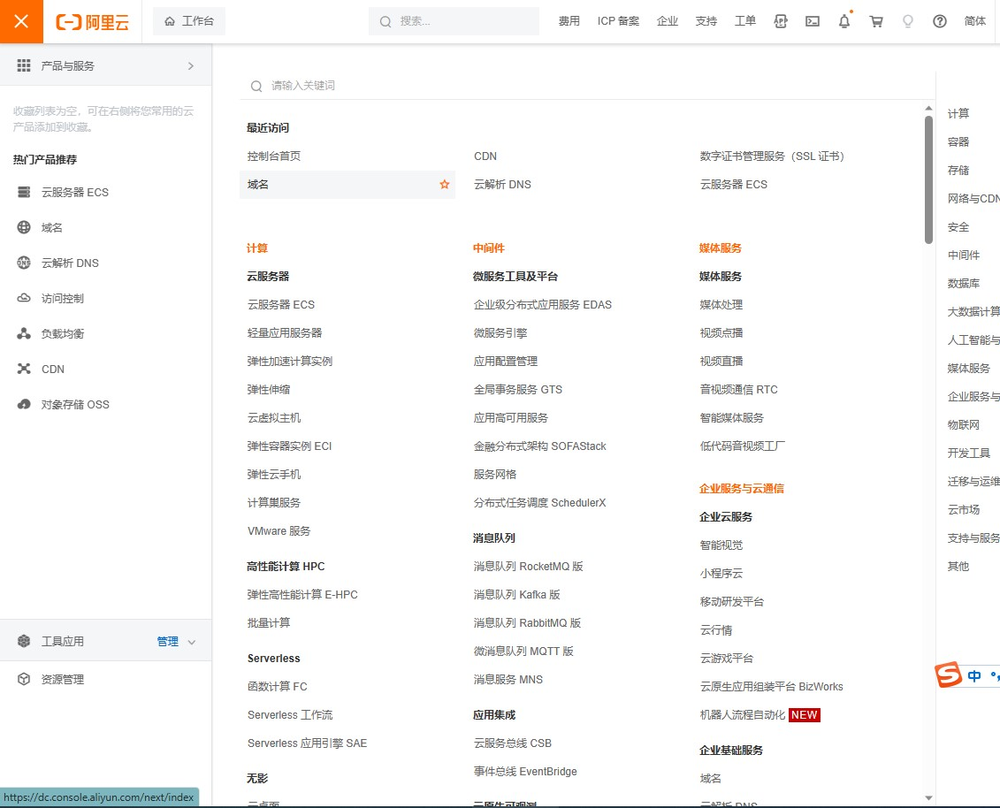
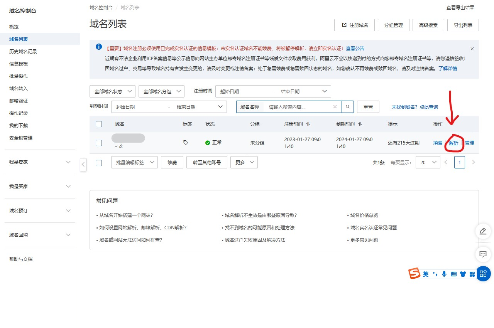
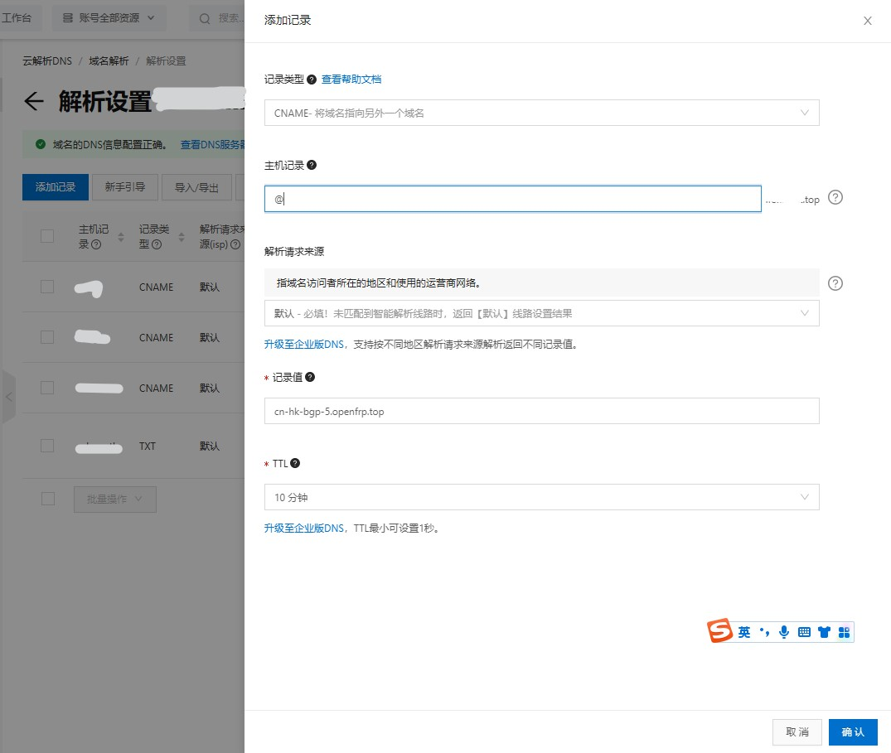
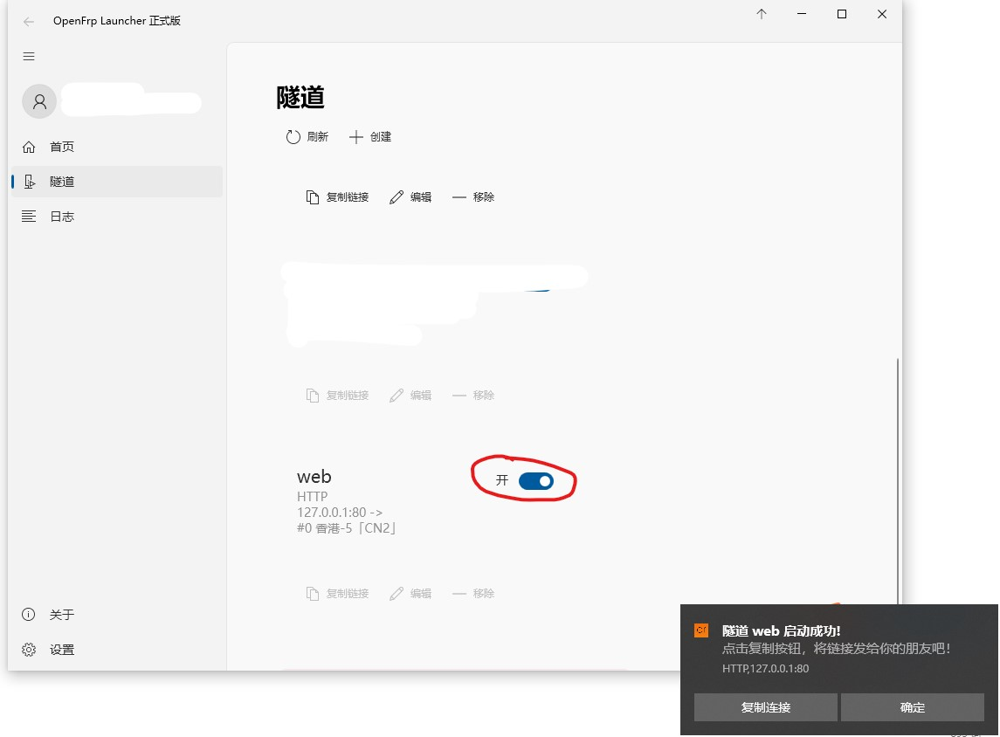
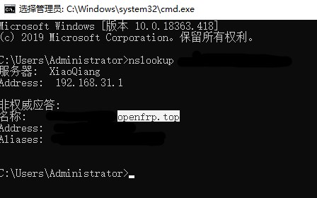

# 常见应用

[TOC]

## 发布网站

> 提示
>
> 这篇文档只涉及 **发布网站** 的教程，您需要有一个 **已经搭好**、**在内网可以访问** 的网站才能进行穿透
> 常见的场景有发布博客或个人网站、外网访问路由器/NAS管理页面等。
>
> 注意：若穿透的是路由器管理等服务，请 **一定设置一个强密码并更改默认用户名**，建议 **打开访问密码功能**，以防止安全问题。

## 1.获得本地 IP、端口和协议

首先用浏览器在内网访问一下服务，然后查看地址栏。访问时显示的网址多半是这样的:

```http
无自定义端口：

http://<本地 IP>/	

有自定义端口：

http://<本地 IP>:<本地端口>/
```

比如：

```http
# 本地 IP: 127.0.0.1,端口80
http://127.0.0.1/

# 本地 IP: 192.168.31.112，端口4000
http://192.168.31.112:4000/index.html
```

可以把这行网址分为四部分：

<ruby>http://<rt>协议</rt></ruby> <ruby>192.168.31.112<rt>ip地址</rt></ruby> <ruby>:4000<rt>端口号</rt></ruby> 

> 注：由于默认http端口号为80，所以当访问http://example.com 的时候，其实是在访问http://example.com:80。

## 2. 确定你需要的协议

我们提供三种 **隧道类型** 供您选择。您可以根据自身需求选择协议。

| 隧道类型 | 支持的协议 | 访问时带端口 | 使用自己的域名 | 举例                                |
| -------- | ---------- | ------------ | -------------- | ----------------------------------- |
| TCP      | http/https | **必须**     | 可选           | http://xxx.openfrp.top:11451        |
| HTTP     | http       | 不需         | **必须**       | http://example.com <br> example.com |
| HTTPS    | https      | 不需         | **必须**       | https://example.com<br>example.com  |

> 编者的题外话：域名+端口的方式可能会不利于搜索引擎的收录。所以如果你想映射博客的话，建议选http（s），还方便记忆。

## 3. 选择穿透节点

在创建节点一页有各节点支持的协议、详细介绍等等。根据需要创建隧道。

这里以香港-5节点，http隧道，域名example.com，本地端口80为例。



填入所有标星号的信息，隧道类型选择http，点击提交，提示"创建成功"并自动跳转到“管理隧道”。

## 4.域名解析

转到“配置文件”一栏，下拉框选择创建隧道的节点，会出现配置详情。复制下方的“server_addr"值，以便稍后使用。


随后登录域名商的控制台。

> 由于各个注册商的用户界面差异较大，我们无法一一列举。如果实在是找不到可以上网搜索。
>
> 这里以阿里云为例。

进入控制台，搜索“域名”字样并进入。



随后点击“解析”进入解析管理



选择“添加解析”，**记录类型**选择CNAME，**主机记录**填写@¹，记录值填写上文的“server_addr"值，随后确认即可。



¹：可根据喜好选择域名前缀。比如

| 主机记录         | 实际网址         |
| ---------------- | ---------------- |
| @                | example.com      |
| www              | www.example.com  |
| (任何字母)如blog | blog.example.com |

<font color='red'>注意：主机记录需与创建隧道时填写的域名一致：比如主机记录为@，则域名为example.com,那么上文创建隧道时填写的域名也应为exampel.com</font>


等待域名解析生效即可用域名的形式连接。根据各服务商的不同，生效时间大概在5分钟--10小时不等。


## 5.启动隧道

启动隧道。若一切正常您就可以通过example.com的形式来访问网站。



----

## 常见问题：

### 1.已经建好，但提示“503 Service Unavailable”

1. 请检查创建隧道时，填写的域名是否与访问域名一致。

   <font color='red'>请注意：www.example.com与 example.com是两个网站</font>

   同样的，a.example.com与b.example.com也是两个网站

2. 请检查FRP客户端是否有报错

   可能由于网络原因，导致客户端与服务器断开连接。一般稍等或手动重启隧道即可解决。

3. 可能节点正在遭受攻击，请通过 [状态监控](https://kuma.openfrp.net/status/of)查看所选节点健康状态，或尝试更换节点。

4. 域名解析到的节点是否和隧道所在的节点相同？

   请注意：DNS 解析修改后并不是立即生效的，解析结果缓存时长从 10 分钟到一星期不等，请等待解析生效后再试。

   Windows可通过以下命令查看dns解析地址

   ```bat
   nslookup <你的域名>
   
   # 例如
   nslookup www.example.com
   ```

   

“名称”需为xx.openfrp.top才代表解析同步成功。

5. 本地的 Web 服务是否成功启动？隧道映射的本地 IP 和端口号是否正确？

- 是否能在 **运行 frpc 的电脑** 通过 **本地 IP** 和 **本地端口** 访问您的网站？
- frpc 有没有显示 `无法连接到本地服务` 等错误？

6. 客户端是否成功启动并出现 `start proxy success` 字样？

- 不要先急着设置开机自启，先手动启动程序确认是否可以成功启动
- 在 Windows 上最好使用启动器管理隧道，Linux最好通过docker部署。

7. (HTTPS 隧道)是否正确创建？访问的时候有没有输入完整的 `https://` 前缀？

- 只创建 HTTPS 隧道会导致使用 HTTP 协议访问时出现 503 错误

### 2. 提示“connection timed out“

可能是节点挂了，请等待或更换节点。


# 文件传输

## FTP文件传输


