# 常见应用

[TOC]
本篇为Github用户[foxhank](https://github.com/foxhank)编写，感谢!!!

## 发布网站

> 提示
>
> 这篇文档只涉及 **发布网站** 的教程，您需要有一个 **已经搭好**、**在内网可以访问** 的网站才能进行穿透
> 常见的场景有发布博客或个人网站、外网访问路由器/NAS管理页面等。
>
> 注意：若穿透的是路由器管理等服务，请 **一定设置一个强密码并更改默认用户名**，建议 **打开访问密码功能**，以减少安全问题。

### 1. 获得本地 IP、端口和协议

首先用浏览器在内网访问一下服务，然后查看地址栏。访问时显示的网址多半是这样的:

```http
无自定义端口：

http://<本地 IP>/	

有自定义端口：

http://<本地 IP>:<本地端口>/
```

比如：

```http
# 本地 IP: 127.0.0.1,端口80
http://127.0.0.1/

# 本地 IP: 192.168.31.112，端口4000
http://192.168.31.112:4000/index.html
```

可以把这行网址分为四部分：

<ruby>http://<rt>协议</rt></ruby> <ruby>192.168.31.112<rt>ip地址</rt></ruby> <ruby>:4000<rt>端口号</rt></ruby> 

> 注：由于默认http端口号为80，所以当访问http://example.com 的时候，其实是在访问http://example.com:80。

### 2. 确定你需要的协议

我们提供三种 **隧道类型** 供您选择。您可以根据自身需求选择协议。

| 隧道类型 | 支持的协议 | 访问时带端口 | 使用自己的域名 | 举例                                |
| -------- | ---------- | ------------ | -------------- | ----------------------------------- |
| TCP      | http/https | **必须**     | 可选           | http://xxx.openfrp.top:11451        |
| HTTP     | http       | 不需         | **必须**       | http://example.com <br> example.com |
| HTTPS    | https      | 不需         | **必须**       | https://example.com<br>example.com  |

> 题外话：域名+端口的方式可能会不利于搜索引擎的收录。所以如果你想映射博客的话，建议选http（s），还方便记忆。

### 3. 选择穿透节点

在创建节点一页有各节点支持的协议、详细介绍等等。根据需要创建隧道。

这里以香港-5节点，http隧道，域名example.com，本地端口80为例。


填入所有标星号的信息，隧道类型选择http，点击提交，提示"创建成功"并自动跳转到“管理隧道”。

### 4. 域名解析

转到"管理隧道"一栏，找到刚刚创建的隧道并左键"操作"，在弹出的菜单中点击详细即可找到CNAME地址
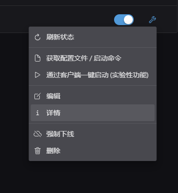
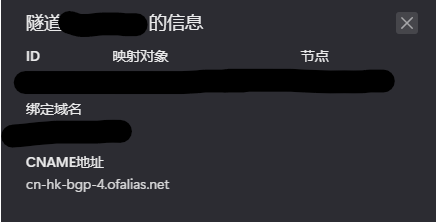

随后登录域名商的控制台。

> 由于各个注册商的用户界面差异较大，无法一一列举。如果实在是找不到可以上网搜索。
>
> 这里以阿里云为例。

进入控制台，搜索“域名”字样并进入。

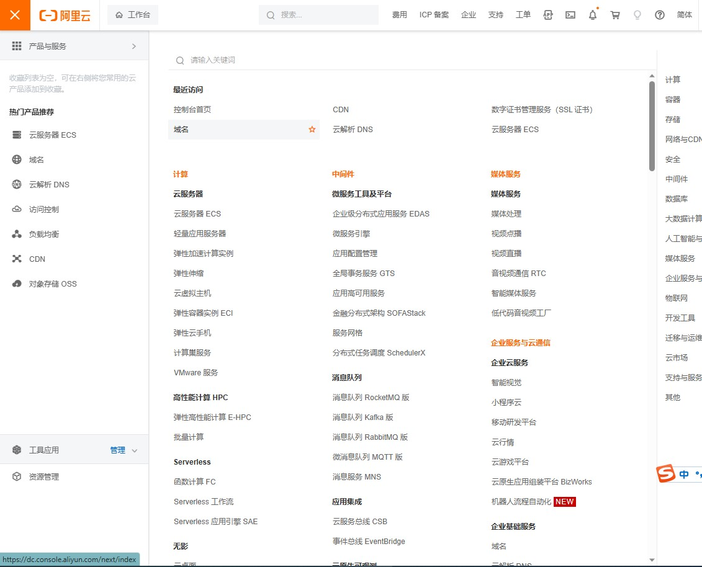

随后点击“解析”进入解析管理

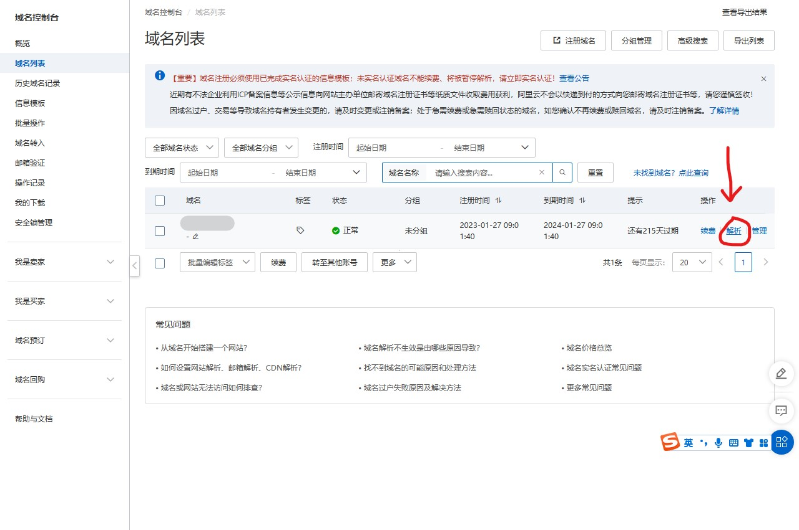

选择“添加解析”，**记录类型**选择CNAME，**主机记录**填写@¹，记录值填写上文的“server_addr"值，随后确认即可。

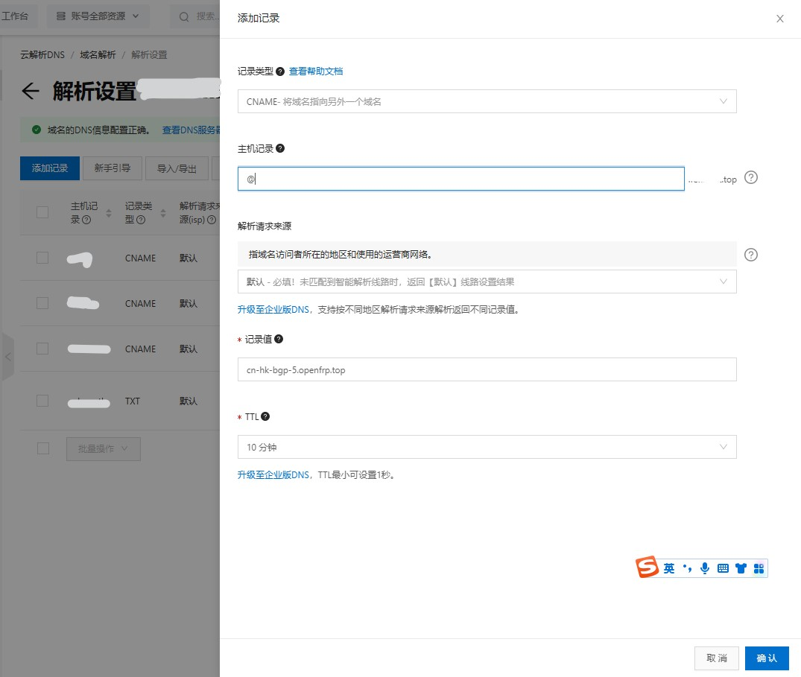

¹：可根据喜好选择域名前缀。比如

| 主机记录         | 实际网址         |
| ---------------- | ---------------- |
| @                | example.com      |
| www              | www.example.com  |
| (任何字母)如blog | blog.example.com |

<font color='red'>注意：主机记录需与创建隧道时填写的域名一致：比如主机记录为@，则域名为example.com,那么上文创建隧道时填写的域名也应为example.com</font>


等待域名解析生效即可用域名的形式连接。根据各服务商的不同，生效时间大概在10秒钟--10小时不等。


### 5. 启动隧道

启动隧道。若一切正常您就可以通过example.com的形式来访问网站。


----

### 常见问题

#### 1.已经建好，但提示“503 Service Unavailable”

1. 请检查创建隧道时，填写的域名是否与访问域名一致。

   <font color='red'>请注意：www.example.com与 example.com是两个网站</font>

   同样的，a.example.com与b.example.com也是两个网站

2. 请检查FRP客户端是否有报错

   可能由于网络原因，导致客户端与服务器断开连接。一般稍等或手动重启隧道即可解决。

3. 可能节点正在遭受攻击，请通过 [状态监控](https://kuma.openfrp.net/status/of)查看所选节点健康状态，或尝试更换节点。

4. 域名解析到的节点是否和隧道所在的节点相同？

   请注意：DNS 解析修改后并不是立即生效的，解析结果缓存时长从 10 分钟到一星期不等，请等待解析生效后再试。

   Windows可通过以下命令查看dns解析地址

   ```bat
   nslookup <你的域名>
   
   # 例如
   nslookup www.example.com
   ```

   

“名称”需为xx.openfrp.top才代表解析同步成功

5. 本地的 Web 服务是否成功启动？隧道映射的本地 IP 和端口号是否正确？

- 是否能在 **运行 frpc 的电脑** 通过 **本地 IP** 和 **本地端口** 访问您的网站？
- frpc 有没有显示 `无法连接到本地服务` 等错误？

6. 客户端是否成功启动并出现 `start proxy success` 字样？

- 在 Windows 上最好使用启动器管理隧道，Linux最好通过docker部署。

7. (HTTPS 隧道)是否正确创建？访问的时候有没有输入完整的 `https://` 前缀？

- 只创建 HTTPS 隧道会导致使用 HTTP 协议访问时出现 503 错误

#### 2. 提示“connection timed out“

可能是节点挂了，请等待或更换节点。


## 远程桌面

### Windows 远程桌面（RDP）

#### 0. 安全提醒

映射远程桌面通常会带来出人意料的风险，因为巨硬的漏洞总是很多。

如果您需要映射远程桌面，我们强烈建议您启用 Windows Update 来避免批量 0day 漏洞利用使得您的电脑遭到攻击，并设置一个账户强密码。

<del>虽然windows的系统更新安起来确实费劲</del>,它可以帮助你免受病毒的侵袭。

#### 0.1 设置账户密码

由于安全原因，windows不允许没有密码的账户进行远程连接。所以，**被连接端**需要设置一个账户密码。

##### 0.1.1 Windows 7设置密码


点击“开始”按钮，并点击右上角的头像，进入“用户账户”


点击“为您的账户创建密码“

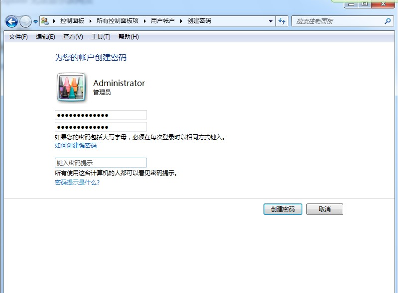

输入两遍密码,点击"创建密码"，密码即设置成功

<strong style="color:red;">注意：密码提示不建议设置，若设置，请写一段只有你和用电脑的人知道的提示词，不要把密码放在密码提示中！</strong>


##### 0.1.2 Windows 10设置密码


点击“开始”按钮，随后点击头像，点击“更改账户设置进入用户账户页面。


选择“登录选项”，随后在密码一栏中点“添加”

输入两遍密码，即可创建。

#### 1. 打开远程桌面功能

请注意：从Windows7开始，家庭版系统不支持远程桌面功能。您可以通过以下方式判断：

右键“我的电脑”，点击属性，查看右侧显示版本名称。

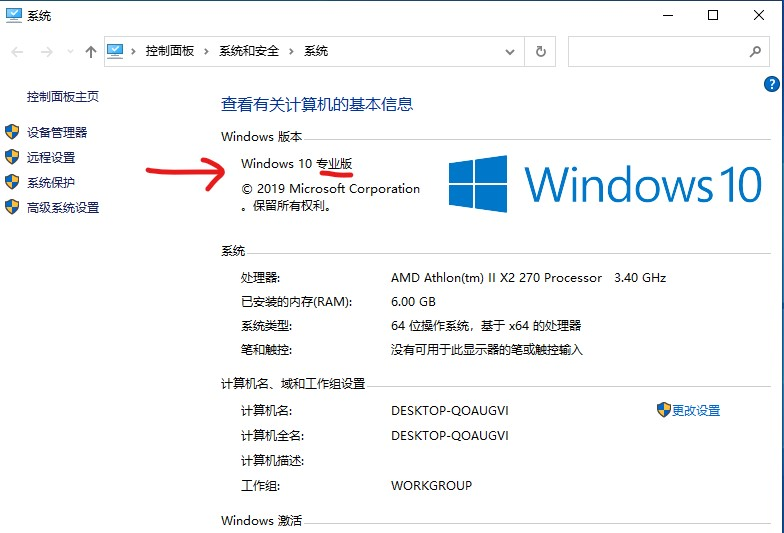

若显示“家庭版”则无法使用。建议升级为专业版，或在网上寻找补丁打开远程桌面功能。**使用补丁可能具有安全风险，请自行甄别**

若您的电脑支持此功能，点击左侧的“远程设置”，随后界面点击"允许远程连接到此计算机"并点击确认

**注意：远程协助和远程连接是两个不同的功能**


随后打开启动器，**创建一个本地端口3389的隧道**,并启动隧道。

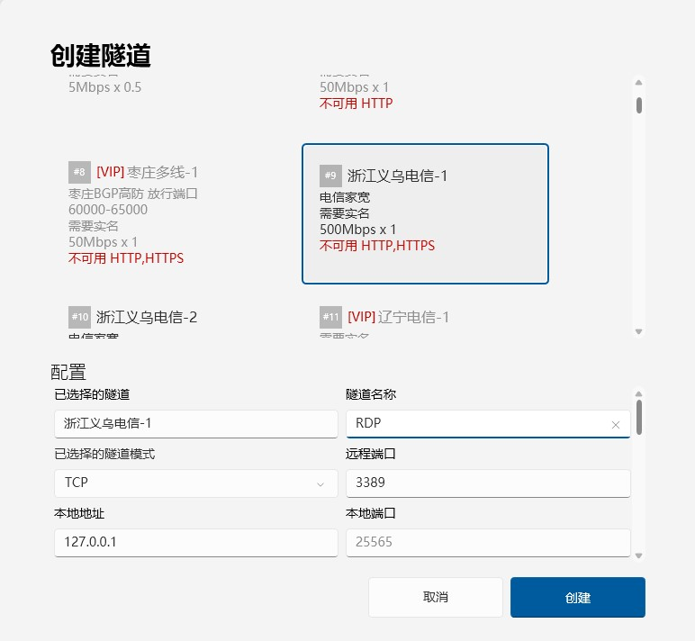

至此，被控端的配置便全部完成。

#### 2.连接电脑

开始菜单-点开“windows附件”文件夹-打开“远程桌面连接”

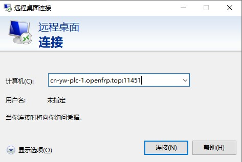

输入对方隧道网址，点击链接


若一切正常，接下来会让你输入用户密码，**输入对方电脑的用户名和密码**，点击确定

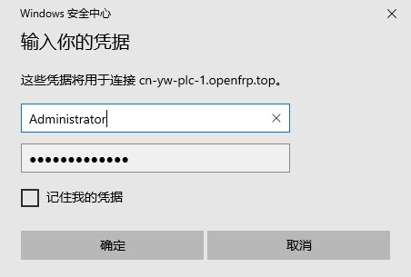

由于电脑使用的是自签证书，会弹出安全提醒，点击“是”即可


稍等片刻即可连接。此时已经可以使用了。

#### 3. 可选：启用UDP连接


这时你会发现，上面的信号栏只有两格信号，质量为良好。虽然也能用，但看着总归不舒服。

解决方法：

创建一个 **相同远程端口，UDP模式**的隧道。随后将两个隧道全开启。

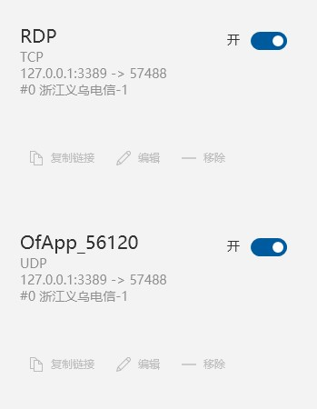

随后重启远程连接，可以发现提示“已启用UDP”，并且“良好”升级为“非常好


## Linux 远程桌面（VNC）

不同于Windows自带的RDP，linux系统一般使用开源的VNC进行远程桌面连接。
> 演示环境：
>
> 被控端：Deepin 20.5，Linux内核5.1.101
> 				OpenFRP V0.48.1 , 

### 1. 安装x11 VNC（若系统自带VNC可跳过）
```bash
sudo apt update
sudo apt install x11vnc -y
```


#### 1.1 设置VNC密码(<font color=red>重要</font>)

只要拥有域名和端口号的人都能通过vnc访问你的设备，所以设置一个密码十分重要

```bash
sudo x11vnc -storepasswd /etc/x11vnc.pass
```


输入两遍密码，会提示你确认一遍路径，输y即可

#### 1.2 配置开机自启

通过systemd控制服务开机自启

```bash
sudo vim /etc/systemd/system/x11vnc.service
```

随后按Insert进入输入模式，将配置复制进去后输入`:wq`保存并退出

```ini
[Unit]

Description=Start x11vnc at startup.

After=multi-user.target

[Service]

Type=simple

#ExecStart=/usr/bin/x11vnc -forever -rfbauth /etc/x11vnc.pass -rfbport 5900 -shared

ExecStart=/usr/bin/x11vnc -auth guess -forever -loop -noxdamage -repeat -rfbauth /etc/x11vnc.pass -rfbport 5900 -shared

[Install]

WantedBy=multi-user.target
```

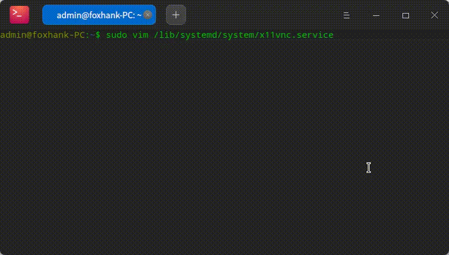


随后systemctl三连击

开机自启`systemctl enable x11vnc`

启动服务`systemctl start x11vnc`

查看状态`systemctl status x11vnc`


若输出中“Active”为“active（running）”则为启动成功，可以看到`PORT=5900`	,意味着服务正运行在5900默认端口上。

### 2. 创建隧道

新建一个本地端口为5900的隧道，其余保持默认即可，点击提交

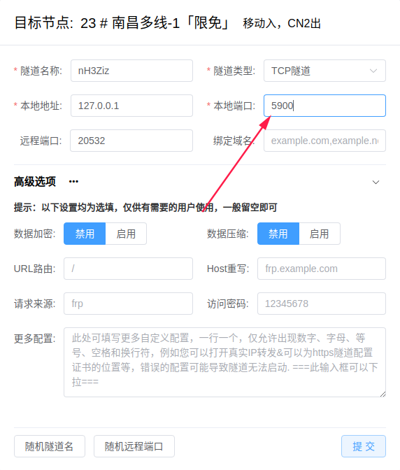

随后转到“隧道管理”，选择刚创建隧道的节点，将配置文件复制下来


### 3. 安装及配置FRP服务

由于Linux版本的frpc没有控制面板，所以需自行配置`frpc.ini`文件。

先按照CPU架构下载[Linux版本的FRPC客户端](https://console.openfrp.net/home/download)，大部分是x86架构的系统，选择amd64即可。

下载后，将文件解压缩，重命名为`frpc`，并在同目录下创建一个名为`frpc.ini`的配置文件，如图所示


打开frpc.ini，将刚才复制的配置文件内容复制进去，保存并退出。

随后右键空白处，选择“在终端中打开“

输入命令启动隧道

```bash
nohup ./frpc -c ./frpc.ini &
```

会提示“忽略输入并把输出追加到”nohup.out“文件中，可通过

```bash
vi ./nohup.out
```

查看运行日志。若启动正常，会提示“隧道启动成功”，且提供一段网址，可通过此网址使用VNC客户端进行连接。


## 群晖 NAS 远程管理

群晖虽然自带一个quickconnect远程管理服务，但黑群晖（盗版系统）用户是用不了的。况且由于群晖的服务器在台湾省，数据一来一回，延迟也高的要命。


> 演示环境：黑群晖 DSM 6.1.7 15284,，OpenFRP Docker端v0.48.0
>


### 1. 确认端口号

局域网进入群晖后台，进入“控制面板”，选择“网络”并切换到“DSM设置”栏，可以看到端口号，默认为5000（http）和5001（https）

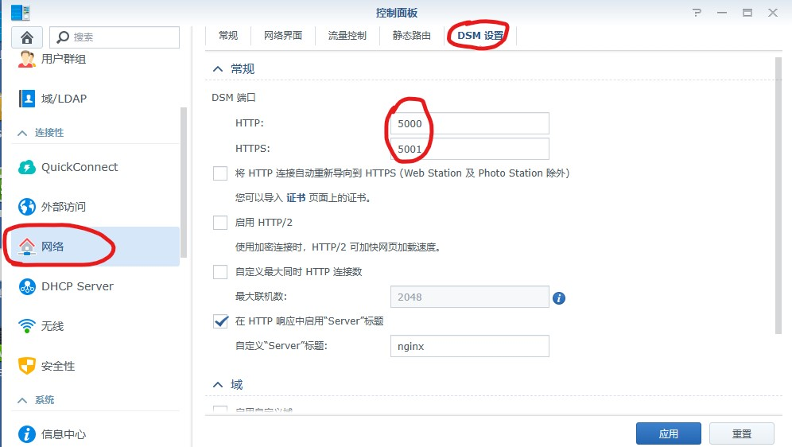

### 2. 创建隧道

在控制台创建一个<font color=red>本地地址为172.17.0.1</font>，本地端口为5000的TCP隧道

随后转到“隧道管理”，记下隧道的ID

再去“首页”复制下你的访问秘钥


<font color=red>注意：请勿将访问秘钥告知任何人，OpenFRP官方不会索取您的访问秘钥，若在交流群里问问题，发送截图前请注意遮挡访问秘钥。若不慎泄露，可去个人中心-重置秘钥 进行秘钥重置</font>


### 3. 使用docker安装OpenFRP

打开套件中心，左上角搜索栏输入“docker”，并点击安装套件。

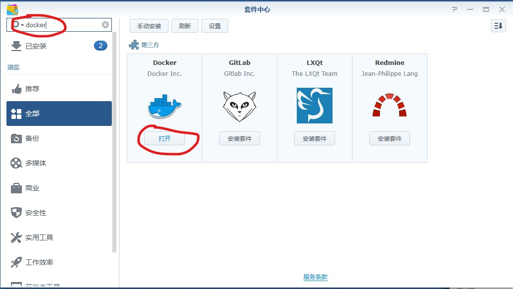

安装完成后点击打开。

由于Docker Hub在国内无法访问，所以选择“注册表”会提示“查询注册表失败”。

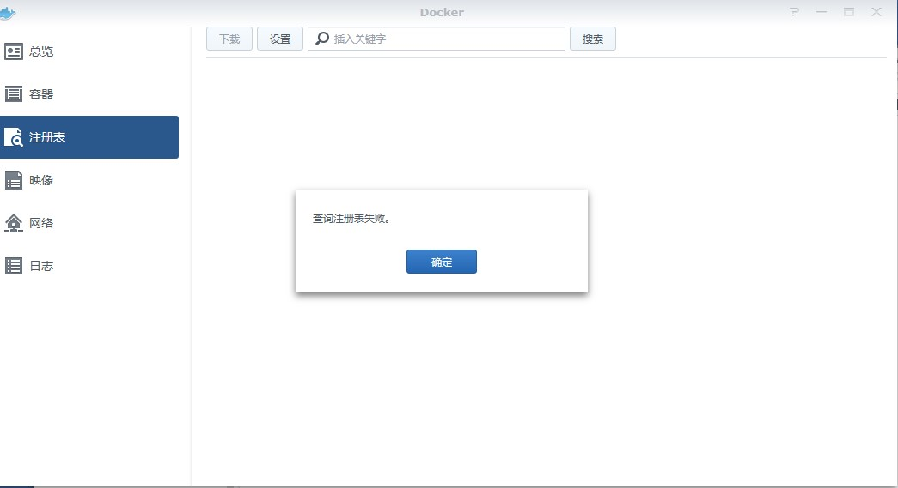

但可以使用docker pull命令下载镜像。

#### 3.1 打开ssh功能

打开控制面板，拉到最下面选择“终端机和SNMP”，勾选“启用ssh功能”并应用。

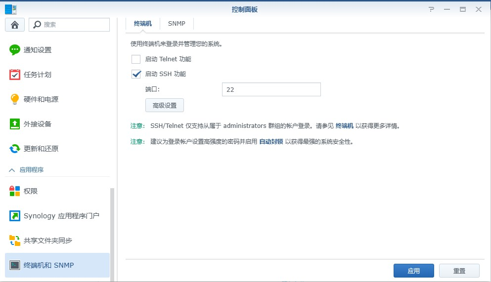


随后Win+R，输入`cmd`，进入命令提示符，输入`ssh （用户名）@（群晖ip）`进行连接。

> 若提示'ssh' 不是内部或外部命令，也不是可运行的程序或批处理文件，说明你的电脑不自带ssh工具，请自行百度搜索“ssh连接群晖”安装工具并进行连接。此处不再赘述。


#### 3.2 创建容器

输入

```bash
sudo docker run -d --name of openfrp/frpc:latest -u (你的访问秘钥) -p （你的隧道ID)
```

将用小括号括起来的字段换成你自己的内容。

比如：`sudo docker run -d --name of openfrp/frpc:latest -u 1145141919810 -p 114514`

若创建多个隧道，可输入

```bash
sudo docker run -d --name of openfrp/frpc:latest -u （你的访问秘钥） -p （你的隧道id）[,（隧道id2）,（隧道id3）]
```

比如 ： `sudo docker run -d --name of openfrp/frpc:latest -u 1145141919810 -p 114514 [,114515 , 114516]`

稍等一会，等显示一串字符就表示开启成功。

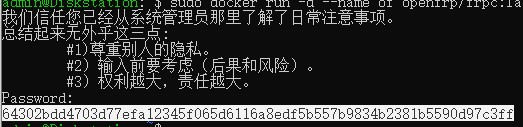

### 4. 查看网址

输入

```bash
sudo docker logs of
```

查看容器日志。

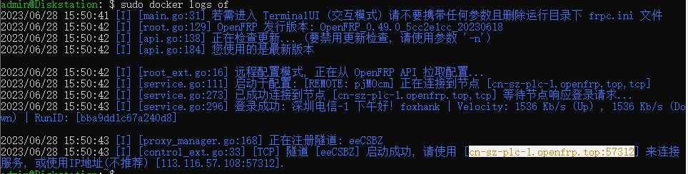

使用提供的网址，即可进入群晖管理页。

### 5. 管理容器

群晖自带有一个可视化docker管理页面，不用每次都连接输命令。

网页控制台中，打开“docker”，选择“容器”找到名叫“of”的容器，即可方便控制开启或关闭


同时，您还可以双击进入容器，点击“日志”栏查看详细日志


## 远程唤醒

> 远程唤醒技术（WOL，Wake-on-LAN）是由网卡配合其他软硬件，通过给处于[待机状态](https://baike.baidu.com/item/待机状态/8552519?fromModule=lemma_inlink)的网卡发送特定的数据帧，实现电脑从停机状态启动的一种技术。
>
> --摘自百度百科

简单地说，网络唤醒就像在<ruby>家里<rt>局域网</rt></ruby>用<ruby>大喇叭<rt>UDP广播</rt></ruby>喊<ruby>电脑的名字<rt>MAC地址</rt></ruby>，就会把对应电脑叫醒。那么，要想在外面也能叫醒电脑，只要安一个远程喇叭就行了。

硬件方面需要网卡支持网络唤醒，不过现在百分之95的网卡都带这个功能，<del>我一个09年的百兆垃圾网卡都支持这个功能</del>

那么，理论成立，实践开始！


### 1. 创建内网穿透隧道

进入创建隧道栏，随便选一个节点，隧道名称随便填，本地端口选9，隧道类型选<font color='red'> UDP </font>，<font color='red'> 本机地址填255.255.255.255 </font>剩下的不用管，可以选“随机远程端口”或者输一个喜欢的数字，点提交


创建完后会自动跳到隧道列表栏，记下隧道ID，等会要用


### 2. 服务器端部署FRPC

我的NAS使用的是黑群晖DSM6.1.7版本，本质上是个魔改的Debian系统，所以可以用Linux的程序

为了方便调试，我使用docker运行，当然也可以使用其它方案，大同小异。

OpenFrp提供了一个官方的docker镜像，可以通过访问秘钥+隧道ID连接。

安装docker，打开SSH访问等步骤不再赘述，由于Docker Hub在国内无法正常访问，但能拉取镜像，所以这里采用ssh安装的方法

首先SSH连上要部署的服务器，输入


```bash
sudo docker run -d --name OpenFRP openfrp/frpc:latest -u （你的访问秘钥） -p （隧道ID） 
```


比如：` docker run -d --name OpenFRP openfrp/frpc:latest -u b7b***1c9 -p 1****0`

安装速度取决于网速


等一会后会显示一串字符，这就代表安装成功

### 3. 被控电脑打开远程开机功能

#### 	3.1 Windows

网络和Internet设置-更改适配器选项，各Windows版本不同，总之要进入网络连接控制里


右键网卡，选择“属性”，依次选“配置”-“高级”-”魔术封包唤醒“，更改为“开启”

ps:如果你电脑的网卡找不到以上选项，就找那种包含“唤醒（wake up）”文字的属性，然后全部设置成开启就是


随后切换到电源管理，把“允许此设备唤醒计算机”打开


至此，系统部分配置完毕，接下来要进BIOS里调整了。

#### 4.修改BIOS设置
由于各个品牌进入BIOS的方法不同，建议百度搜索“电脑品牌+BIOS”，有详细的方法，一般是开机狂按某个键或者按机箱/笔记本侧边的特定按钮。
进入BIOS后，按箭头键切换到“高级”一栏（或：电源管理），选择“PCI设置”，将‘Power On By PCIE/Onboard Lan’打开，（或者叫网络唤醒之类的名字）
将其切换为enable后 按F10保存并退出。


#### 5.发送唤醒包

##### 5.1 Windows端
首先要下载一个wol的程序。不大，是个命令行程序，方便一键执行
[WOLCMD网站][1] 
[下载][2]
下载是一个压缩包，打开后选择解压到C:\根目录里，方便调用命令行，或者可以修改成一个自己熟悉的文件夹，不过下面的命令就需要修改

之后Windows+R组合键，输入CMD，打开命令行，输入

```bash
cd /d C:\ 
wolcmd （网卡MAC地址） （frp服务器地址）255.255.255.0 （隧道端口）

```
比如  
`wolcmd b8975a4d6e5b cn-hk-bgp-5.openfrp.top 255.255.255.0 11451` 
如果一切顺利，会提示“唤醒信号已发送至设备”，并显示frp服务器的ip地址和端口


如果不清楚如何获取mac地址，可以看下面的5.1.1


###### 5.1.1被唤醒电脑获取网卡MAC地址
Windows＋R组合键，输入CMD，打开命令行，输入命令

 `ipconfig /all` 

会输出一大堆东西，找到名字叫以太网（有线连接）或者叫无线网络适配器（wifi连接）的，这就是此网卡的MAC地址


###### 5.1.2 通过bat批处理实现一键开机
新建一个文本文件，把上面的唤醒命令全部复制进去

随后重命名文件，将后缀修改为.bat

修改完后就可以通过点击这个文件进行一键唤醒

##### 5.2 安卓安装唤醒程序

可以去各大应用商店搜索关键词“Wake On LAN”，比如谷歌商店就有
或者下载这个安装包
https://cowtransfer.com/s/3a06bd6050a64c
提取码bjtym5

右下角+号-左上角手动输入

输入你的信息即可，如图

随后保存，返回到主页，点击条目即可发送唤醒信息

##### 5.3 微信小程序唤醒
有很多支持网络唤醒的小程序，只要填入信息也可以做到远程唤醒。
具体可微信小程序搜索“网络唤醒”，都有详细的使用方法


##### 常见问题：
1.无法唤醒？
- 请留意电脑关机后，路由器端网卡指示灯是否还亮着，否则可能是网卡断电，需要去BIOS的电源管理里设置
- 电脑最后一次关机是否为正常关机（点击关机键关机），意外断电无法使用wol唤醒
- 台式电脑是否关闭过总电源？断电会造成存储的信息丢失，需要重新开机后关机才能使用

2.网卡设置中没有唤醒选项？
可以尝试升级网卡驱动，部分非常非常古老的网卡可能没有这个功能，那也无能为力

[1]: https://www.depicus.com/wake-on-lan/wake-on-lan-cmd
[2]: https://www.depicus.com/downloads/wolcmd.zip

## 部署 MCSManager 管理面板
### 0.1 前言

> 使用 MCSManager 管理面板需要一定的基础知识（例如启动命令），下载 MCSManager 面板请前往[ MCSManager 的官网](https://mcsmanager.com/)下载。

使用 MCSManager 面板即代表您默认同意承担**节点掉线导致的无法访问服务器后台**的风险！

使用 MCSManager 时，请设置一个高强度的密码，避免密码被暴力破解，也请不要使用诸如 **12341234**、**12345678**、**abc123456** 等低强度的密码！

### 0.2 系统环境

教程将以 **Windows Server 2012 R2 系统**，**MCSManager 10** 做示范，其它版本的操作系统可能有差异。

请确保在运行 MCSManager 时，您的账户为 Administrator 或具有管理员权限的账户！

### 1.1 启动 MCSManager 面板

当您下载并解压完毕 MCSManager 面板之后，您将会看到如下界面：


双击 `start.bat`，启动 MCSManager 面板。成功启动后，您应该会看到两个 `node_app` 的窗口，这两个窗口是 MCSManager 的主窗口，无须担心。


稍等一会后，您的默认浏览器应该会自动打开 `localhost:23333/#/install` 这个网站。在此处，`localhost` 指的就是 `127.0.0.1`，把它记住，等会还要用。

此时，您可以按照 MCSManager 的提示一步步操作，部署自己的 Minecraft（或其它游戏）的服务器。

### 1.2 设置


在默认情况下，您的面板端口默认是 `23333`，这个端口即是一会要穿透出去的端口。您也可以自定义一个五位数端口，例如 `11451`、`54188` 等端口。

启动 OpenFrp 软件，创建一个隧道，将本地地址设置为 `127.0.0.1`，端口设置为 `23333`（即刚才的面板端口）。名字可以起一个自己好记的端口，方便自己，也方便运维（如果您的服务器拥有管理团队）。

以 `#15 驻马店移动`节点为例，设置应该如下图一般：


创建完毕后，您可以直接开启并访问这个地址。注意，您必须使用 IP 地址访问（即 `xxx.xxx.xxx.xxx:xxxxx`），否则您将无法访问面板。

### 2 远端服务器配置

如果所有的设置都正确，您应该可以看到如下界面：


恭喜您！您已经完成了基础配置！

接下来，我们将要进行远程服务器配置。首先，请牢记每一个 MCSManager 默认面板节点端口默认都是 `24444`，这个端口很重要！请记住！

在 OpenFrp 中，创建一个本地地址为 `127.0.0.1`、本地端口为 `24444` 的节点。设置如图：


创建隧道，开启隧道。

在日志中，找到对应的 IP 地址，复制它。


在 MCSManager 面板中，找到`应用实例`，点击右侧的`选择远程节点`，点击`配置远程节点`，点击`新增节点`。配置如下图：


点击`确定`，即可完成最后一步的配置。此时您应该能看到刚刚添加的节点了。

## 更多...

欢迎各位大佬投稿，发布各种各样的应用教程！

您可以在[Github上发布pull request](https://github.com/ZGIT-Network/OpenFrp-Docs)，我们看到了会及时处理。

