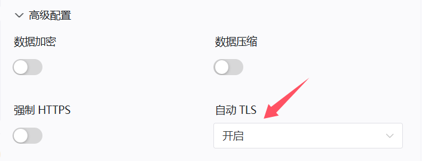

# 进阶配置

## 自动TLS(HTTPS)配置

:::warning 请注意！
如果：您本地访问网站或服务**已经是**`HTTPS`或`TLS`  
如果：您**不知道**自己的网站或服务需不需要`HTTPS`或`TLS`  
**!!请不要配置此项目!!**
:::

隧道类型选择`HTTPS`，端口填写`80`或你在第一步获取的`HTTP`端口  

打开**高级配置**选项卡，将`自动TLS`设置为**开启**

>访问时提示证书错误是正常的，如果您想避免该提示，请配置SSL证书
