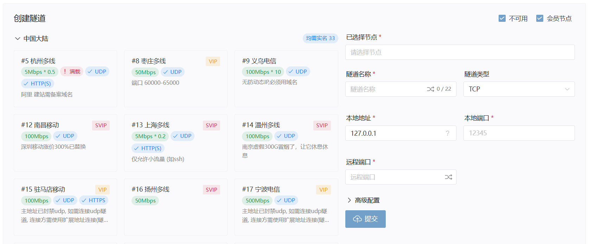
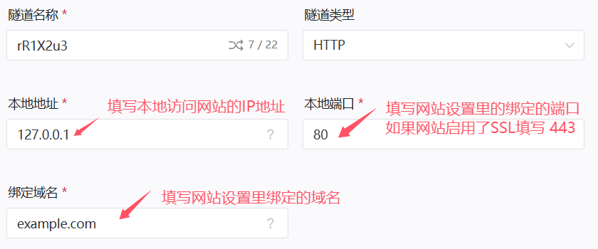

# 宝塔Web面板配置

::: tip 适用场景

- 你 **熟悉** 宝塔面板的 **基本操作**  
- 你的网站 **可以在内网或本地访问**  

本指南 **不涉及** 任何应用的搭建教程，您需要先自行搭建好网站再来阅读本指南
:::

## 添加你的域名

打开你的 **宝塔面板**  
打开 **需要配置的网站** 的 **站点设置**，你会看到网站绑定的 **域名(IP地址)** 和对应的 **端口**

请记住此处显示的 **域名(IP地址)** 和 **端口**，并确认你可以在 **内网或本地** 访问。
:::tip 请在此处添加在 外网 访问的域名！

- 如未添加域名，将 **无法使用** `HTTP` 和 `HTTPS` 隧道
- 没有自己的域名？[获取Natayark免费域名](/use/other/free-domain.html#获取域名)
:::

## 确定你的隧道类型

|隧道类型|默认端口|访问方式|绑定域名|
|:-------:|:--------:|:----:|:---:|
|[HTTP](#http-https隧道) |`80`                   |`http://example.com`      |**必须**|
|[HTTPS](#http-https隧道)|`443`                  |`https://example.com`     |**必须**|
|[TCP](#tcp隧道)         |自定义（除`80`,`443`外）|`https://example.com:端口`|可选    |

>若您的宝塔Web面板实例与OpenFRP实例不在同一环境下，请不要忘记 **放行防火墙端口**

- 使用 **中国大陆** 节点创建 `TCP` 隧道需要 **实名认证**
- 使用 **中国大陆** 节点创建 `HTTP` 和 `HTTPS` 隧道需要 **实名认证**，且您的域名需要在 **工信部备案**
- 已通过 **工信部备案** 的域名需要在[用户中心](https://openid.17a.ink/dashboard)添加 **备案域名** 后才能创建隧道
- 没有自己的域名？[获取Natayark免费域名](/use/other/free-domain.html#获取域名)

## 创建隧道

### HTTP/HTTPS隧道

打开[OpenFrp控制面板](https://console.openfrp.net/create-proxies)，选择侧边栏的 **创建隧道** 选项。

选择带有 `√ HTTP(S)` 或 `√ HTTPS` 标识的节点，在左上角的隧道类型选择 `HTTP` 或 `HTTPS`  
如下图所示，填入你在第一步获取的 **域名(IP地址)** 和 **端口**

:::tip
`√ HTTP(S)` 节点可以创建HTTP隧道和HTTPS隧道，`√ HTTPS` 节点仅能创建HTTPS隧道  
如果您的网站没有HTTPS，但您需要在外网通过HTTPS访问，请见[自动HTTPS配置](/use/configuration/advanced.html#自动tls-https-配置)
:::

信息填写完成后点击 **提交**，若提示 **创建成功** 并自动跳转到 **管理隧道** 页面，则隧道创建成功

### TCP隧道

打开[OpenFrp控制面板](https://console.openfrp.net/create-proxies)，选择侧边栏的 **创建隧道** 选项。

选择任意节点，在左上角的隧道类型选择 `TCP`  
如图所示，填入你在第一步获取的 **IP地址** 和 **端口**

信息填写完成后点击 **提交**，若提示 **创建成功** 并自动跳转到 **管理隧道** 页面，则隧道创建成功

## 设置解析

:::tip 什么情况下需要设置解析？

- `HTTP` 和 `HTTPS` 类型的隧道 **必须** 设置解析
- `TCP` 类型的隧道可以设置解析，也可以使用节点域名或节点IP **带端口** 访问
:::

在 **管理隧道** 页面中，找到你新创建的隧道，点击最右侧的 **操作** 按钮，选择 **详情**

此处可以查看你的 **绑定域名** 和 **节点地址**
如下图所示，**节点地址** 是 `example.ofalias.com`，**绑定域名** 是 `example.com`

:::tip 绑定域名和您设置解析的域名需完全一致

- **记录类型** 选择 `CNAME`
- **记录值** 填写 **节点地址**
- **主机记录** 按你的 **域名前缀** 填写
:::
| 主机记录     | 域名前缀 | 实际网址         |
| :-------------:|:-------:| :-------------: |
 @               |    无    | `example.com`    |
| www           |   www   | `www.example.com`|
| abcd           |   abcd   | `abcd.example.com`|

确认好你要设置的 **记录类型**、**记录值**、**主机记录** 和 **域名** 后，请到 **域名注册商控制台** 设置解析记录  
下方列出了部分域名注册商设置解析的方式，如果不会操作，可以咨询 **域名注册商客服**  

- [阿里云](https://help.aliyun.com/zh/dns/add-a-dns-record#h2-cname-2)
- [腾讯云](https://cloud.tencent.com/document/product/302/3450)
- [Natayark免费域名](/use/other/free-domain.html#cname记录)

至此，恭喜你完成了所有配置👍
