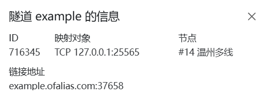

# 我的世界（Minecraft）服务端配置

::: tip 适用场景

- 你已经配置好Minecraft服务端
- 你的服务端 **可以在内网或本地访问**

本指南 **不涉及** Minecraft服务端的搭建教程，您需要先自行搭建好再来阅读本指南
:::

## 确认你的端口

### Java版

打开你的服务端配置文件 `server.properties`，一般位于你的服务端同目录  
在其中找到 `server-port` 配置项

``` properties
server-port=25565
```

此配置项为Minecraft服务端监听的本地端口，默认为 `25565`

### 基岩版

打开你的服务端配置文件 `server.properties`，一般位于你的服务端同目录  
在其中找到 `server-port` 配置项

``` properties
server-port=19132
# Which IPv4 port the server should listen to.
# Allowed values: Integers in the range [1, 65535]

server-portv6=19133
# Which IPv6 port the server should listen to.
# Allowed values: Integers in the range [1, 65535]
```

此配置项为Minecraft基岩版服务端监听的本地 `IPv4` 端口，默认为 `19132`  
>`server-portv6` 配置项为Minecraft基岩版服务端监听的本地 `IPv6` 端口，默认为 `19133`  
>
>- 进行内网穿透时，一般只使用 `IPv4` 进行连接  
>- 如需使用 `IPv6` 连接到基岩版服务端，请为 `IPv4` 和 `IPv6` 分别创建隧道  

### Gayser(间歇泉)

打开你的Gayser服务端配置文件 `config.yml`，一般位于你的服务端同目录  
在其中找到 `port` 配置项

``` yml
bedrock:
  # The IP address that will listen for connections.
  # Generally, you should only uncomment and change this if you want to limit what IPs can connect to your server.
  #address: 0.0.0.0
  # The port that will listen for connections
  port: 19132
  # Some hosting services change your Java port everytime you start the server and require the same port to be used for Bedrock.
  # This option makes the Bedrock port the same as the Java port every time you start the server.
  # This option is for the plugin version only.
```

此配置项为Gayser服务端监听基岩版连接的本地端口，默认为 `19132`  
>**Java版客户端** 直连 **Java版服务端** ，您需要为 **Java版服务端** 额外配置一条隧道

## 确认你的隧道类型

|隧道类型|游戏版本|默认端口|连接方式|解析方式|
|:-------------:|:-----------:|:-----:|:-----------------:|:-----------------:|
|[TCP](#tcp隧道)|Java         |`25565`|`example.com:25565`|SRV (可隐藏端口)    |
|[UDP](#udp隧道)|基岩版(Gayser)|`19132`|`example.com:19132`|CNAME (不可隐藏端口)|

>若您的Minecraft服务器实例与OpenFRP实例不在同一环境下，请不要忘记 **放行防火墙端口**

- Gayser 服务端需要分别创建通向 **Gayser服务端** 的`UDP`隧道和通向 **Java服务端** 的`TCP`隧道  
- Minecraft 基岩版服务端 **不支持** 使用 **SRV解析** 隐藏访问端口  
- Minecraft Java版服务端一般使用 `TCP` 连接与客户端通信。如您安装了其他Mod，请以Mod文档为准  

## 创建隧道

### TCP隧道

打开[OpenFrp控制面板](https://console.openfrp.net/create-proxies)，选择侧边栏的 **创建隧道** 选项。


选择任意节点，在左上角的隧道类型选择 `TCP`  
如图所示，填入你的服务端 **IP地址** 和 `server-port` 配置项中的 **端口**


信息填写完成后点击 **提交** ，若提示 **创建成功** 并自动跳转到 **管理隧道** 页面，则隧道创建成功

### UDP隧道

打开[OpenFrp控制面板](https://console.openfrp.net/create-proxies)，选择侧边栏的 **创建隧道** 选项。


选择任意节点，在左上角的隧道类型选择 `UDP`  
如图所示，填入你的服务端 **IP地址** 和 `server-port` 配置项 **或** Gayser配置项 `port` 中的 **端口**


信息填写完成后点击 **提交**，若提示 **创建成功** 并自动跳转到 **管理隧道** 页面，则隧道创建成功

## 设置SRV解析

:::tip 什么情况下可以设置SRV解析？

- 您使用的是 **Java版服务端**
- 您连接服务端时想要使用 **自己的域名**
- 您连接服务端时 **不想填写端口**
:::

在 **管理隧道** 页面中，找到你新创建的隧道，点击最右侧的 **操作** 按钮，选择 **详情**


此处可以查看你的 **节点地址** 和 **远程端口**  
如下图所示，**节点地址** 是 `example.ofalias.com`，**远程端口** 是 `37658`
>你也可以在 **启动器日志** 中查看你的 **节点地址** 和 **远程端口**  



- **记录类型** 选择 `SRV`
- **记录值** 填写格式一般为 **优先级** **权重** **端口** **目标地址** ，每项中间需以空格分隔 例如：`0 5 25565 example.com`
- **主机记录** 按你想要的 **域名前缀** 填写

| 主机记录     | 域名前缀 | 连接地址         |
| :-------------:|:-------:| :-------------: |
|`_minecraft._tcp`|    无    | `example.com`    |
|`_minecraft._tcp.mc`|   mc   | `mc.example.com`|
|`_minecraft._tcp.abcd`|   abcd   | `abcd.example.com`|

确认好你要设置的 **记录类型**、**记录值**、**主机记录** 和 **域名** 后，请到 **域名注册商控制台** 设置解析记录  
下方列出了部分域名注册商设置解析的方式，如果不会操作，可以咨询 **域名注册商客服**  

- [阿里云](https://help.aliyun.com/zh/dns/add-a-dns-record#h2-srv-8)
- [腾讯云](https://cloud.tencent.com/document/product/302/12647)
- [Natayark免费域名](/use/other/free-domain.html#srv记录)

至此，恭喜你完成了所有配置👍
