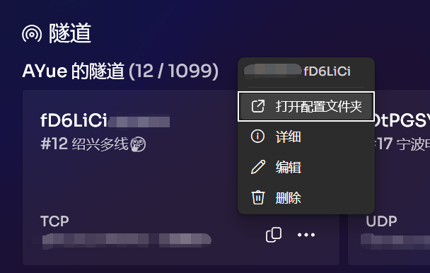
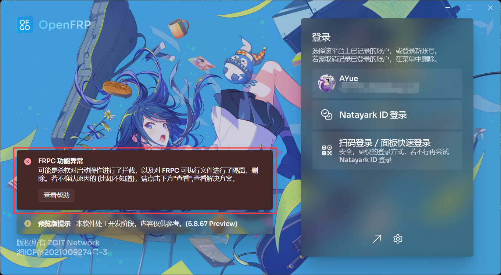
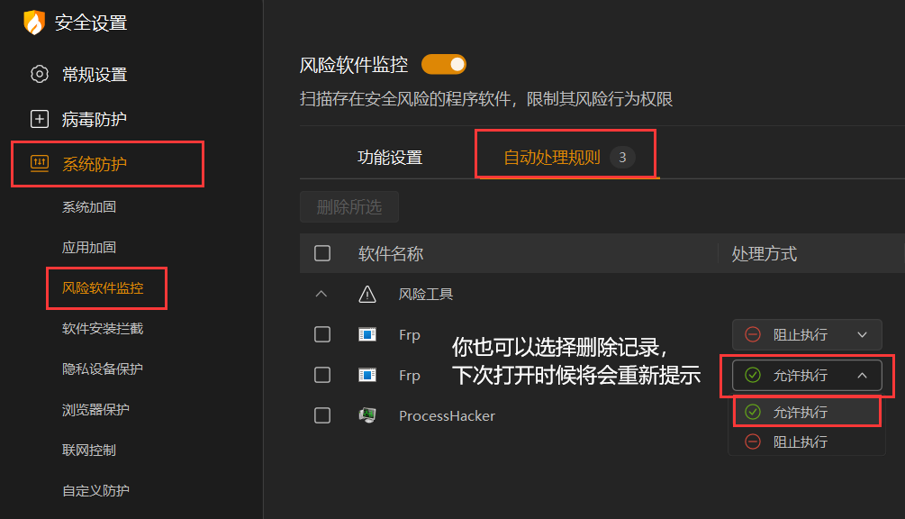
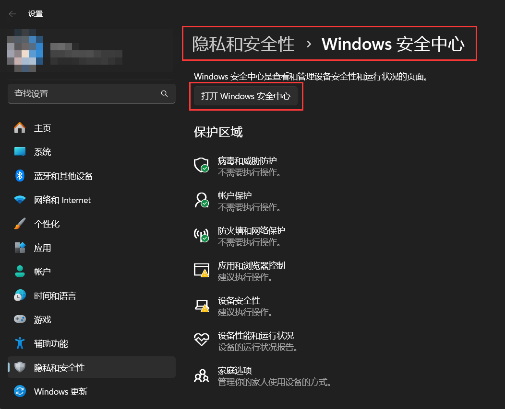
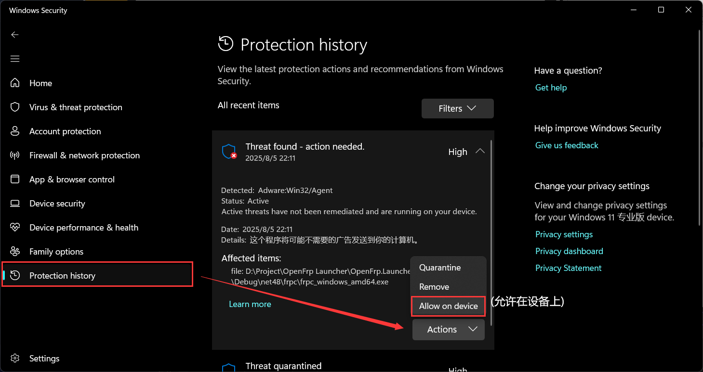
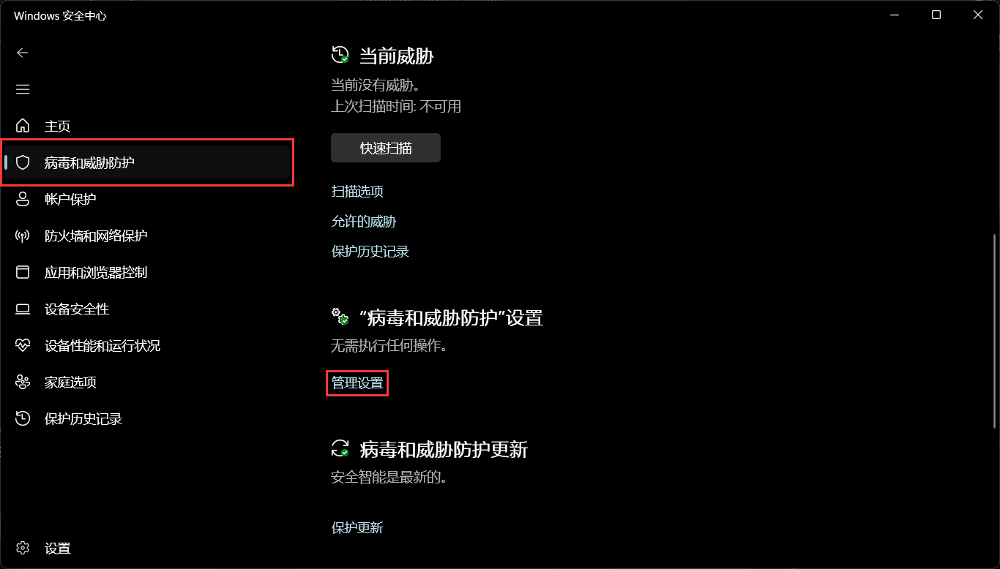
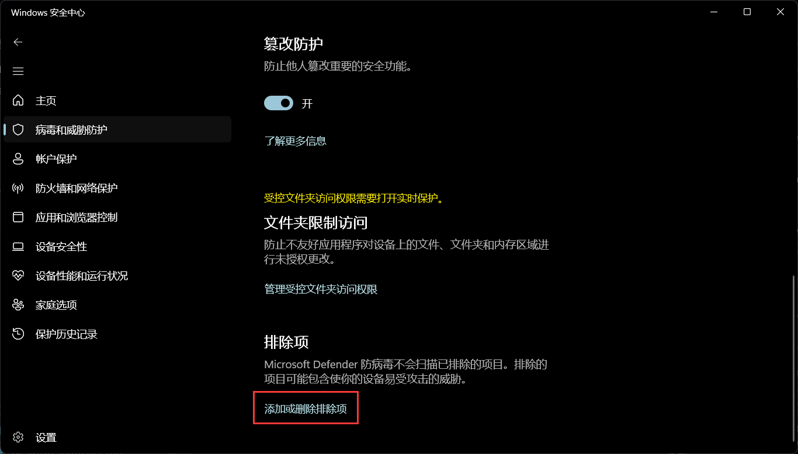
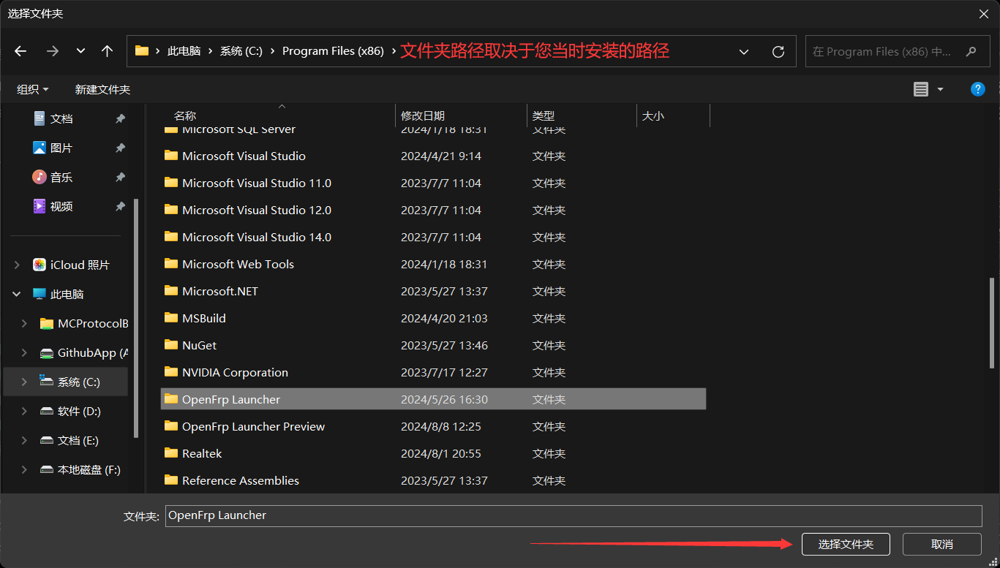

# Windows WPF 桌面启动器

因为已整合网页版的登录，您不需要自备 UserToken, 直接进行登录操作即可 

## 如何进行 FRPC 配置（例如证书）

## Windows 7 无法正常打开

首先，您需要保证您的系统为 Windows 7 SP1,然后接着下一步。

由于国内系统精简过度 / 不喜欢更新，导致
`Microsoft Root Certificate Authority 2011`
缺失，这会导致您无法直接安装`.Net Framework`

您需要在互联网上找到该证书，然后安装。（过程略）

接着，您便可以直接安装 .NET Framework (版本 4.8，且最好使用离线安装包)

## FRPC 功能异常

若您使用了 Windows Defender （不是防火墙），请参见下方 [加入系统白名单](#加入系统白名单)

若您使用了火绒，且第一次使用时在**风险弹窗**点击了拒绝，请参见下图：

## 加入系统白名单

如果您信任我们，可以把对应文件夹 / 文件 加入杀软白名单；如果您更信任杀软，您可以卸载我们的启动器并更换为上游官版 FRPC。

如果您使用的是 Windows Defender ，请按照以下步骤进行：

打开 Windows Defender 后，您有以下两个选项，其中方法 2 较为稳靠，在更新时不会触发规则。

### 方法1：在拦截时到 "保护历史" 中找到相关记录，允许。

### 方法2: 添加文件夹白名单

进入后，点击 "添加排除项" - "文件夹"

对于图片三，建议将上级文件夹(即 OpenFrpLauncher 文件夹)
加入系统白名单。

如果您是懒人用户,请直接安装其他杀软屏蔽系统自带杀软即可(如火绒)。

### Another... | 其他....

请先更新启动器到最新版本后再反馈......另外，你们为什么不喜欢更新启动器啊。
