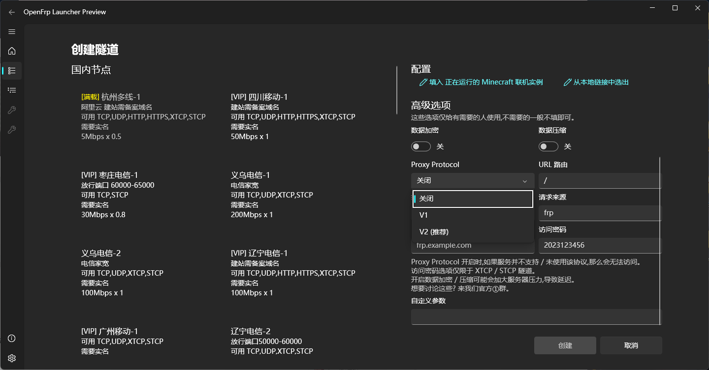

# 使用过程

本篇章会混杂一些视频内容。如果这也不会，建议进群。

## Windows FRPC启动器(推荐)

启动器基于微软官方提供的 .NET Framework 和 Wpf。

小白级别，希望你会用。



您只需一路点前进,无需太多操作。

> 启动器可能有些 BUG ,欢迎前往 [兔小巢](https://support.qq.com/product/424684) 与我们反馈 BUG<br>
> 本启动器开源。

## FRPC

我们也为 FRPC 提供了 TUI (Terminal UI)，使您在 Linux，Windows 或者 Mac OS 也能比较容易的启动。
您需要准备你的 UserToken (用户秘钥)。

### Windows

> 我们建议您使用启动器，支持系统服务模式。（RDP福利）
> 在Windows上,您只需下载后解压，双击即用。

### Linux

首先您需要确定您的系统架构，输入以下命令查看。

``` bash
uname -a
```

根据以下对照表，寻找对应平台的 FRPC

| 平台          | 对应 FRPC        |
|-------------|----------------|
| i386        | i386, i686     |
| amd64       | x86_64         |
| arm_garbage | 	arm, armel    |
| armv7       | armv7l, armhf  |
| arm64       | aarch64,armv8l |
| mips        | mips           |
| mips64      | mips64         |

> 如果您的架构显示为 armv7l，但在下载对应程序后无法运行，提示 Illegal instruction 的话，这是因为您其实是 armel 而不是
> armhf，请下载 arm_garbage 版本重试

如果您的架构为 mips 或 mips64，还需要使用下面的命令来确定处理器的字节序

``` bash
# 一般来说只需要使用这条命令:
echo -n I | hexdump -o | awk '{print substr($2,6,1); exit}'

# 如果上面的命令报错，请尝试这条:
echo -n I | od -to2 | awk '{print substr($2,6,1); exit}'

```

| 平台                | 结果  |
|-------------------|-----|
| mips / mips64     | 0   |
| mipsle / mips64le | 1   |

#### 安装 Frpc

登入管理面板,转到软件下载
在架构一栏找到适合您的Linux版本，复制红色的那一串下载链接
使用下面的命令进入 /usr/local/bin 目录并下载文件：

``` bash
cd /usr/local/bin 

# 如果您使用 wget，用以下命令:
wget <url>
# 如果上面命令报错 / 您喜欢用 curl，请使用:
curl <urL>
```

下载成功后，使用该命令解压:

``` bash
tar -zxvf <tar.gz文件>
```

解压后输入下面的命令设置权限:

``` bash
chmod 755 <解压后出来文件名>
ls -ls <解压后出来文件名>
```

反馈的权限应该是: -rwxr-xr-x

#### 开始运行

还记得篇章写的什么吗？您可以直接输入文件名运行。

```bash
./frpc_linux_amd64 # = 或 = 
frpc_linux_amd64 #执行后，您将进入 TerminalUI 
```

> 对于 Termux，你需要修复 DNS 的问题。具体方法自行百度。

### Docker 容器

目前 Docker 支持的平台

> linux/386 |
> linux/amd64 |
> linux/arm64/v8 |
> linux/arm/v7 |
> darwin/amd64 |
> darwin/arm64

```bash
# 启动命令: 
docker run -d --name of --restart unless-stopped openfrp/frpc:latest -u <访问密钥> -p <隧道ID>[<,隧道ID><,隧道ID>]
# 查看状态: 
docker logs of
```

若您希望使用配置文件运行，映射目录为 `/run`

```bash
docker run -d --name of --restart unless-stopped -v /path/to/your/frpc.ini:/run/frpc.ini openfrp/frpc:latest
```

如何更新容器:

```bash
# 先停止容器
docker stop of
# 然后删除容器
docker rm of
# 更新本地镜像
docker pull openfrp/frpc:latest
# 重新运行容器即可
docker run -d --name of --restart unless-stopped openfrp/frpc:latest -u <访问密钥> -p <隧道ID>[<,隧道ID><,隧道ID>]
```

<!-- Docker THE END -->

### Mac OS

你需要下载 FRPC (Darwin)。

Mac分为 Apple 芯片 和 Inter 芯片 （最常见）
架构也有所不同：
| Apple CPU | Inter CPU |
| --- | --- |
| arm64 | amd64 |

解压后,根据Linux的方式去设置权限:

``` bash
chmod 755 <解压后出来文件名>
ls -ls <解压后出来文件名>
```

后用Finder找到文件后 双击运行即可


