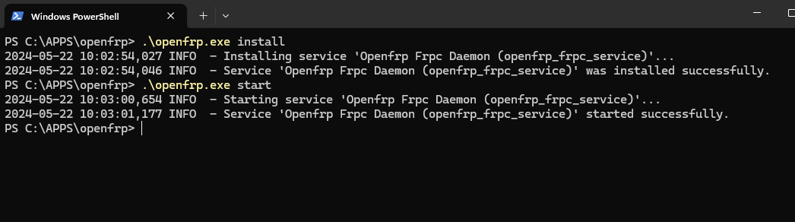
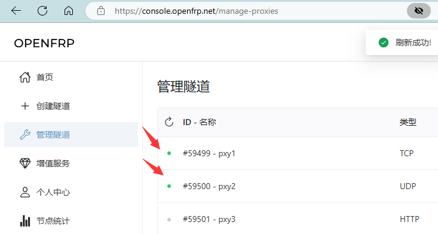

# frpc的开机自启相关

本章节仅包含frpc的自启动指南，不含桌面版启动器和任何第三方启动器

## Linux下自启动

::: tip
推荐使用Debian系统，始终不推荐使用CentOS系统，**!不支持 Termux 及其相关的程序!**
::: tip

1. 使用wget或其他工具 [下载](https://d.of.gs/client/) 适合您操作系统架构的最新版本的frpc 
（例如: [frpc_linux_amd64.zip](https://d.of.gs/client/OpenFRP_0.57.0_e511492b_20240423/frpc_linux_amd64.tar.gz)） 


下载完成后解压得到二进制文件，并赋予其执行权限 <br />
```bash 
chmod +x ./frpc_linux_amd64
```

2. 复制下面的`systemd unit服务文件内容`到你的文本编辑器

```
[Unit]
Description=OpenFrp Frpc Daemon
After=network.target

[Service]
User=root
Restart=on-failure
RestartSec=5s
WorkingDirectory=/path/to/your/dir
ExecStart=/path/to/your/dir/frpc_linux_arch_file -u your_token -p your_proxy_id,your_proxy_id2,your_proxy_id3
LimitNOFILE=1048576

[Install]
WantedBy=multi-user.target
```

3. 将工作目录和二进制可执行文件的 `绝对路径` 替换为你的实际路径

4. 将用户token和隧道id替换为你实际获取到的token和id

5. 将此文件命名为 `openfrp.service` 并存放于目录 `/etc/systemd/system/`

6. 执行命令启动并设置自启: 

```bash
systemctl daemon-reload
systemctl enable --now openfrp
```

7. 查看运行状态: 

```bash
systemctl status openfrp
```
::: tip
显示为 running 即代表正常运行。<br />
如果一切顺利，您可以在网页面板查看到隧道已启动
::: tip

### 管理自启动服务
要更改用户token或隧道id，请先编辑文件 `openfrp.service`，保存后执行命令:

```bash
systemctl daemon-reload
systemctl restart openfrp
```

要删除自启动服务，只需执行: 

```bash
systemctl disable --now openfrp
```

## docker下自启动

docker会为所有容器自启动，这是默认值。<br />
如果您的docker容器没有自动启动，请自行查阅docker相关文档，本章节不再赘述

## windows下自启动

**! 如果您使用的是桌面版启动器，您只需要保持隧道开启即可，本章节不适用任何桌面版启动器 !**

::: tip
本章节使用 `WinSW` 演示进行 `windows服务` 自启动，
::: tip

下载[frpc](https://d.of.gs/client/)

选择适合您操作系统架构的最新版本的frpc
（例如 [frpc_windows_amd64.zip](https://d.of.gs/client/OpenFRP_0.57.0_e511492b_20240423/frpc_windows_amd64.zip)） 

下载完成后解压得到exe可执行文件

下载[WinSW](https://github.com/winsw/winsw/releases)

选择适合您操作系统架构的最新 Release 
（例如 [WinSW-x64-2.12.0.exe](https://github.com/winsw/winsw/releases/download/v2.12.0/WinSW-x64.exe)）

下载完成后，将其重命名为 openfrp.exe

复制下面的xml配置到你的文本编辑器

```xml
<service>
<name>Openfrp Frpc Daemon</name>
<description>Openfrp Frpc Daemon</description>
<id>openfrp_frpc_service</id>
<executable>frpc_windows_amd64.exe</executable>
<arguments>-u your_token -p your_proxy_id,your_proxy_id2</arguments>
</service>
```

将`frpc.exe`替换为实际文件名，将用户token和隧道id替换为你的实际获取值，并将此文件保存命名为 `openfrp.xml`

示例如图:


现在你的文件夹下应只有三个文件

::: tip
注意: 此文件夹请放在合适的位置，后续不能删除其中任何文件
::: tip

按住Shift 右键空白区域打开windows终端


输入命令安装并启动服务:

```powershell
.\openfrp.exe install
.\openfrp.exe start
```



如果一切顺利，您可以在网页面板查看到隧道已启动



如果您的隧道未能正常启动，建议查阅同目录下 `.log` 文件获取日志来排查问题; 若仍有其他疑问，建议入群交流 (本文档首页有群号)

要删除服务，请执行如下命令，然后删除整个文件夹即可

```powershell
.\openfrp.exe stop
.\openfrp.exe uninstall
```

要更改用户token或隧道id，请先停止并卸载服务，然后编辑xml文件内容，保存后再执行上述安装&启动命令即可

## macos下自启动

To be continued
