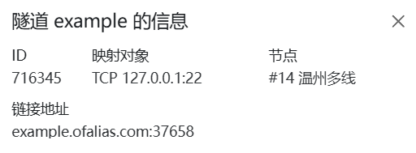

# SSH远程终端配置

:::danger 安全警告
穿透SSH前 **必须** 确保您已经设置了 **强登录密码** 或使用 **密钥验证登录**  
进行内网穿透等于 **绕过所有防火墙** 将您的计算机直接暴露于公网中，您需要自行承担由此带来的风险
:::

## 确认你的端口

SSH的 **默认端口** 一般为 `22`  

- 若您不确定是否为该端口，可打开SSH配置文件 `/etc/ssh/sshd_config`，在其中找到 `Port` 配置项

``` ini
# If you want to change the port on a SELinux system, you have to tell
# SELinux about this change.
# semanage port -a -t ssh port t -p tcp #PORTNUMBER
Port 22
```

`Port` 后方的数字即为SSH使用的端口，此处为默认端口 `22`

## 确定你的隧道类型

|隧道类型| 默认端口| 远程端口|
|:-------------:|:---:|:-----:|
|[TCP](#tcp隧道)|`22` | 自定义（不建议与默认端口相同）|

>若您的SSH实例与OpenFRP实例不在同一环境下，请不要忘记 **放行防火墙端口**

## 创建隧道

### TCP隧道

打开[OpenFrp控制面板](https://console.openfrp.net/create-proxies)，选择侧边栏的 **创建隧道** 选项。


选择任意节点，在左上角的隧道类型选择 `TCP`  
如图所示，填入SSH实例的 **IP地址** 和 **端口**


信息填写完成后点击 **提交**，若提示 **创建成功** 并自动跳转到 **管理隧道** 页面，则隧道创建成功

## 连接到SSH

在 **管理隧道** 页面中，找到你新创建的隧道，点击最右侧的 **操作** 按钮，选择 **详情**


此处可以查看你的 **节点地址** 和 **远程端口**  
如下图所示，**节点地址** 是 `example.ofalias.com`，**远程端口** 是 `37658`
>你也可以在 **启动器日志** 中查看你的 **节点地址** 和 **远程端口**  



在终端中使用 `ssh -p 远程端口 SSH用户名@节点地址`连接到SSH  

```bash
ssh -p 37658 username@example.ofalias.com
```

至此，恭喜你完成了所有配置👍
