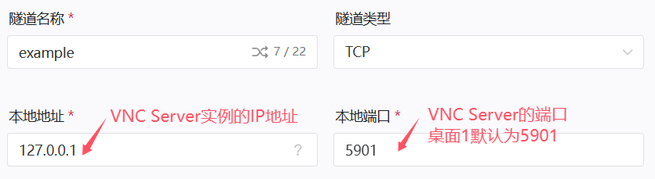
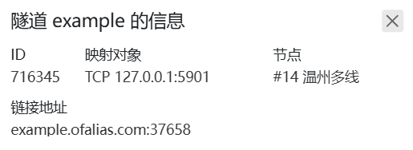

# VNC远程桌面配置

::: tip 适用场景

- 你已经配置好VNC Server
- 你的服务端 **可以在内网或本地访问**

本指南 **不涉及** VNC Server的搭建教程，您需要先自行搭建好再来阅读本指南
:::

## 确认你的端口

VNC Server的 **默认端口** 一般为 `5900+桌面号`  
例如，您要连接到1号桌面，使用的端口为 `5901`

## 确定你的隧道类型

|隧道类型| 默认端口| 远程端口|
|:-------------:|:---:|:-----:|
|[TCP](#tcp隧道)|`5900+桌面号` | 自定义（不建议与默认端口相同）|

>若您的VNC Server实例与OpenFRP实例不在同一环境下，请不要忘记 **放行防火墙端口**

## 创建隧道

### TCP隧道

打开[OpenFrp控制面板](https://console.openfrp.net/create-proxies)，选择侧边栏的 **创建隧道** 选项。

选择任意节点，在左上角的隧道类型选择 `TCP`  
如图所示，填入VNC Server实例的 **IP地址** 和 **端口**

信息填写完成后点击 **提交**，若提示 **创建成功** 并自动跳转到 **管理隧道** 页面，则隧道创建成功

## 连接到VNC Server

在 **管理隧道** 页面中，找到你新创建的隧道，点击最右侧的 **操作** 按钮，选择 **详情**

此处可以查看你的 **节点地址** 和 **远程端口**  
如下图所示，**节点地址** 是 `example.ofalias.com`，**远程端口** 是 `37658`
>你也可以在 **启动器日志** 中查看你的 **节点地址** 和 **远程端口**  

在VNC Viewer中使用 **节点地址**:**远程端口** 连接到VNC Server  
例如 `example.ofalias.com:37658`

至此，恭喜你完成了所有配置👍
