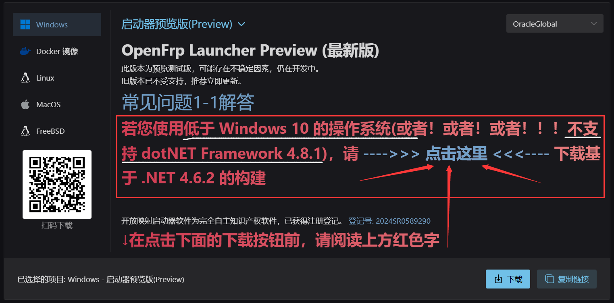
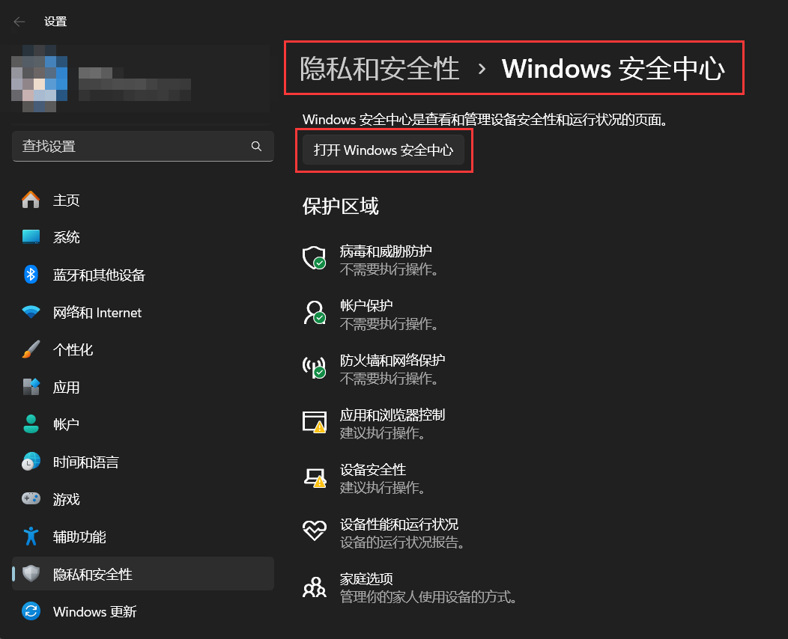
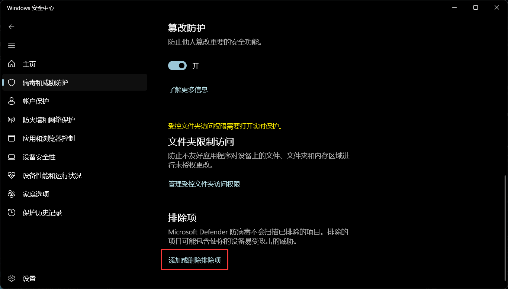
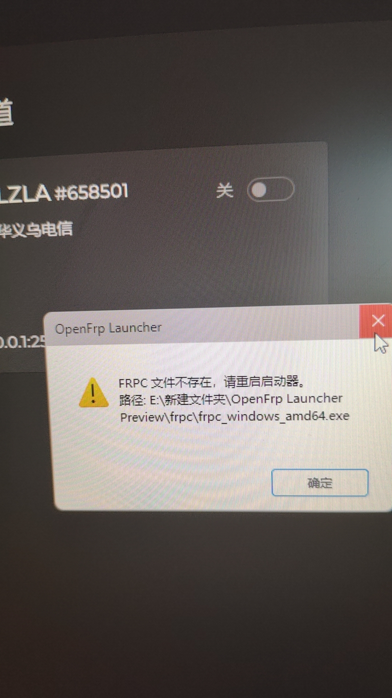

# Windows 桌面启动器

如果您来到这里了,您可能是刚刚使用，因为很简单，压根不需要怎么看就会的。

因为已整合网页版的登录，您不需要自备 UserToken, 直接进行登录操作即可 

## 系统服务模式


* 系统服务模式<br/>
  **可以满足系统重启后,FRPC自动开启的需求**，适用于各种 RDP 服务需要 (建议您备用一款远程软件) 。在系统开启后(在登录页面前),服务便会启动，FRPC也会随着开启。
* 守护进程模式<br/>
  正常你不需要调整就为该模式，当重启后您需要 **经过登录页面登录后** 才能进行开机自启。(`就算是自动登录,也推荐上面第一方式。`)

## Windows 7 无法正常打开

首先，您需要保证您的系统为 Windows 7 SP1,然后接着下一步。

如果您下载的带有尾缀 "net481" ，请下载另一个尾椎为 "net462" 的版本，否则你将卡死在这一步。



由于国内系统精简过度 / 不喜欢更新，导致
`Microsoft Root Certificate Authority 2011`
缺失，这会导致您无法直接安装`.Net Framework`

您需要在互联网上找到该证书，然后安装。（过程略）

接着，您便可以直接安装 .NET Framework (最低为4.6.2，建议4.8，且最好使用离线安装包)

## 我是 Windows 10，但是也无法打开也无法卸载

如图所示


请直接从官网下载另一个尾椎为 "net462" ,然后直接替换安装。


## 加入系统白名单

如果您信任我们,可以把对应文件夹 / 文件 加入杀软白名单,如果您更信任杀软,您可以卸载我们的启动器且更换为上游官版 FRPC。

如果您使用的是 Windows Defender ，请按照以下步骤进行:





进入后，点击 "添加排除项" - "文件夹"


对于图片三，建议将上级文件夹(即 OpenFrpLauncher 文件夹)
加入系统白名单。

如果您是懒人用户,请直接安装其他杀软屏蔽系统自带杀软即可(如火绒)。

## 其他常见问题

### System.TypeLoadException: 程序集“PresentationCore”中的类型“MS.Internal.Automation.SelectionProviderWrapper”的方法“GetSelection”没有实现。

这是由于一个 Windows 更新包的问题，参见如下：

在Windows更新管理界⾯中，找到“卸载更新”

Windows 10：[官⽅⽂档](https://support.microsoft.com/zh-cn/windows/%E5%A6%82%E4%BD%95%E5%8D%B8%E8%BD%BD-windows-%E6%9B%B4%E6%96%B0-c77b8f9b-e4dc-4e9f-a803-fdec12e59fb0#ID0EBF=Windows_10)
1. 选择“开始”按钮，然后选择“设置 >更新&
安全 > Windows 更新> 查看更新历史记
录 >卸载更新。
也可以使⽤命令：(<a href="ms-settings:windowsu
pdate-history?activationSource=SMC-A
rticle-12415">打开</a>)

```
ms-settings:windowsu
pdate-history?activationSource=SMC-A
rticle-12415
```

2. 选择并按住 (或右键单击要删除的更新) ，
然后选择“卸载”。

Windows11：
1. 选择“开始” > “设置” > “Windows 更新”
 “更新历史记录” > “卸载更新”。<br/>
 <br/>
也可以使⽤命令：(<a href="ms-settings:windowsu
pdate-history?activationSource=SMC-A
rticle-12415">打开</a>)
```
ms-settings:windowsu
pdate-history?activationSource=SMC-A
rticle-12415
```
2. 在显示的列表中，找到要删除的更新，然后
选择“卸载”

附加：要卸载的更新:
1. KB5011050
2. KB5028947
3. KB5011048

若您下载的为 .NET Framework 4.8.1 版本的启动器，请切换为 .NET Framework 4.6.2 版本的启动器。在此之后请勿安装 .NET Framework 4.8.1，否则问题将会复现。

### System.Configuration.ConfigurationErrorsException: 配置文件已被另一个程序更改。

按下 Windows + R
(Windows 键就是键盘上那颗徽标)
输入:
```bash
cmd /c rmdir /s /q %appdata%/../Local/OpenFrpLauncher
```

### System.Runtime.InteropServices.COMException: {已禁用桌面合成} 操作无法完成，因为已禁用桌面合成

检查你是否在使用 Microsoft RDP 服务...

如果是这样的话，请你右键启动器的桌面快捷图标，

在目标这一框中后面加入 "--no-effect" (请在前面加空格分开)

### 找不到 FRPC 文件

如图所示



请参见 [加入系统白名单](#加入系统白名单)

### Another... | 其他....

请先更新启动器到最新版本后再反馈......另外，你们为什么不喜欢更新启动器啊。
