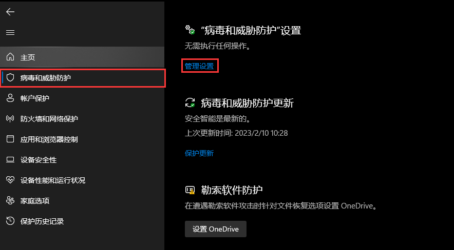
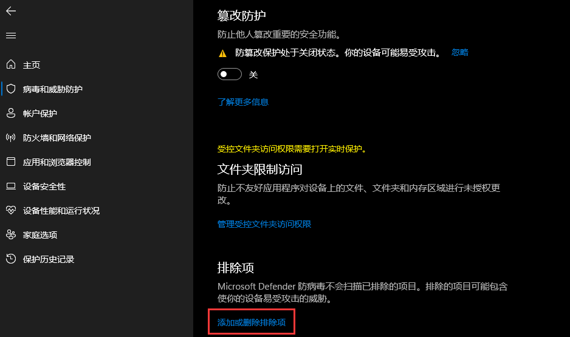
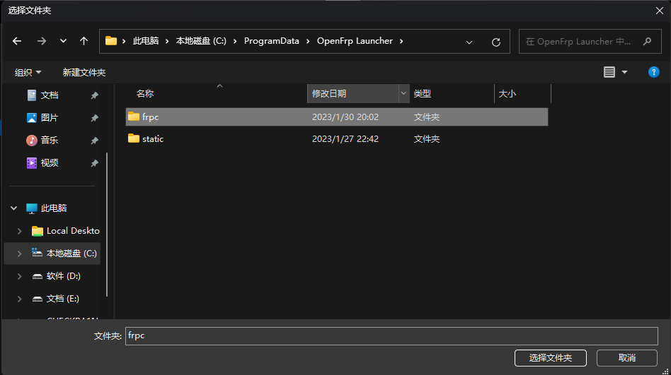

# Windows 桌面启动器

如果您来到这里了,您可能是刚刚使用，因为很简单，压根不需要怎么看就会的。

因为已整合网页版的登录，您不需要自备 UserToken, 直接进行登录操作即可 

## 系统服务模式

在多次修改后,启动器已分为 Launcher 和 Core 的形式,而 Core 是主核心，Launcher 只是一个管理它的工具。当 Launcher 崩溃后，您已运行的隧道不会直接`暴毙`，~~毕竟我们家的软件 BUG 很多呢。~~

那么以下就是这两种模式的区别:

* 系统服务模式 
  **可以满足系统重启后,FRPC自动开启的需求**，适用于各种 RDP 服务。当然你需要备用一款软件，毕竟 FRPS 服务可能`随时暴毙`, Core 服务在系统启动后会自动启动,在登录屏幕时服务`即已运行`。
* 守护进程模式 
  正常你不需要调整就为该模式，当重启后您需要 **经过登录页面登录后** 才能进行开机自启。(`就算是自动登录,也推荐上面第一方式。`)

## 加入系统白名单

如果您信任我们,可以把对应文件夹 / 文件 加入杀软白名单,如果您更信任杀软,您可以卸载我们的启动器且更换为上游官版 FRPC。

> 上图的路径找不到？点一下上面编辑框空白区域，输入 %programdata%/OpenFrp.Launcher/ 然后回车就能跳转过去了.

如果您是懒人用户,请直接安装其他杀软屏蔽系统自带杀软即可(如火绒)。
