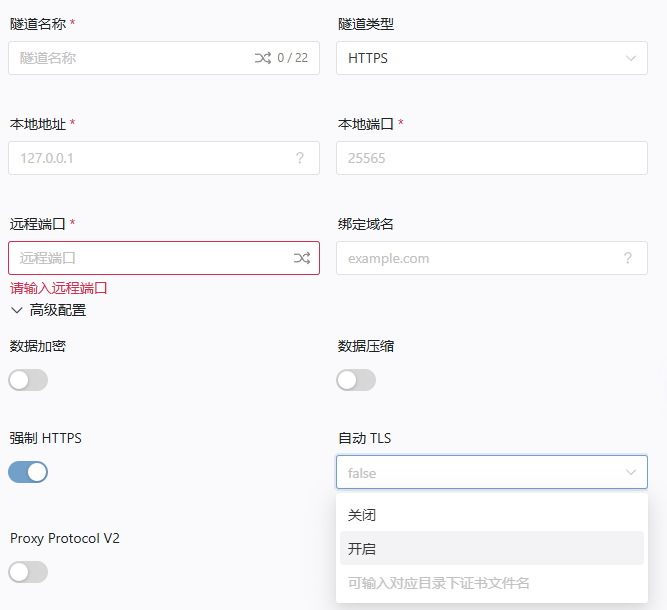
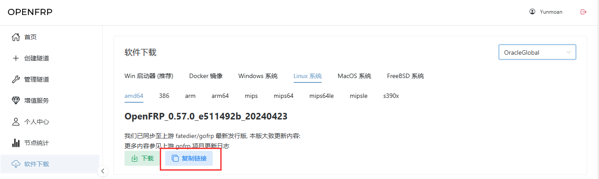

## FRPC 的 HTTPS 功能

::: tip
从 OpenFrp 5.0 (Ocean) 开始 AUTO TLS 功能已不再需要手动设置配置文件，以下为新版配置教程。
::: 


*以下为 OpenFRPC (0.44.0+) 版本才可使用的功能。*

> 适用于新版配置文件，本教程所示方法需要将新版配置文件(toml)转换为旧版(ini)格式后才可以在旧版使用。<br />
> 请参见 “[OpenFrp TOML转换INI工具](https://api.zyghit.cn/toml-to-ini/)”。<br />
> 我们仍建议立即更新至最新版本的 Frpc 以获得最新功能支持。

本功能可以在 TCP 链接上使用 TLS 套接字。
或把 HTTP 服务以 HTTPS 隧道穿透流量。

### TCP隧道

针对 TCP 隧道，可通过以下方法启用 自动TLS 功能：


* 有关 TCP 隧道的 `自动TLS` 功能
  * 关闭<br/>不会为 TCP 流量打上 TLS 套接字。*（默认）*
  * 开启<br/>系统会自动生存一个证书，且证书`不受信任`、CommonName 不含任何域名。
  * <文件名>  <br/>在此选择框内直接输入文件名即可。
  会试图访问调试目录下的 `<上述的文件名>.crt` 和 `<上述的文件名>.key` 两个证书文件。
若文件不存在或解析失败 效果与 `自动TLS ：启用` 相同。**（调试目录可通过在frpc命令行后加上 `--debug` 后启动获得。）**

在当前版本中，启用 自动TLS 所用模式将为先前的 `auto` 模式，隧道会探测本地服务是否为http/s。

<br/>

### HTTPS隧道

同样的，针对 HTTPS 隧道，有关 自动TLS 的功能实现类似。


针对 HTTPS 隧道，额外支持 强制HTTPS 功能。

* 有关 `强制 HTTPS` 功能
  * 访问 http://example.com 会自动跳转到 https://example.com,且状态码为 `301 Moved Permanently` <br />返回的 Location 头包含 Host、Path 和 Query。
  * 此隧道包含的所有域名对应的 `http` 隧道无效。访问 http://example.com `一定会` 自动跳转到 https://example.com,`一定不会` 去尝试访问对应的 `http` 隧道。

 
<br/>

## FRPC 的 HTTPS 功能(已过时，旧版，但保留备用)
::: tip
旧版https文档已经迁移至[这里](./frpc-old)
::: 

## Windows

> 建议您使用启动器,小白用户当然可以试试学这篇。

Windows 具有以下平台:

* ARM64
* X86
* X64 (最常见)

您需要找到对应的平台且下载。如果您是 Windows XP 或 Windows Vista 的极客用户,请下载上游的 [0.28.2](https://github.com/fatedier/frp/releases/tag/v0.28.2) 版本

下载且解压完成后,您可以直接双击可执行文件或使用命令行进入:

```powershell
frpc_windows_<平台>.exe -u <你的token> -p <隧道id>,[id,id]
```

## Linux

首先您需要确定您的系统架构，输入以下命令查看。

```bash
uname -a
```

根据以下对照表，寻找对应平台的 FRPC

| 平台          | 对应 FRPC        |
|-------------|----------------|
| i386        | i386, i686     |
| amd64       | x86_64         |
| arm_garbage | 	arm, armel    |
| armv7       | armv7l, armhf  |
| arm64       | aarch64,armv8l |
| mips        | mips           |
| mips64      | mips64         |

::: tip
如果您的架构显示为 armv7l，但在下载对应程序后无法运行，提示 Illegal instruction ，这是因为您其实是 armel 而不是armhf，请下载 arm_garbage 版本重试
::: 

如果您的架构为 mips 或 mips64，还需要使用下面的命令来确定处理器的字节序

``` bash
# 一般来说只需要使用这条命令:
echo -n I | hexdump -o | awk '{print substr($2,6,1); exit}'

# 如果上面的命令报错，请尝试这条:
echo -n I | od -to2 | awk '{print substr($2,6,1); exit}'
```

| 平台                | 结果  |
|-------------------|-----|
| mips / mips64     | 0   |
| mipsle / mips64le | 1   |


### 下载 Frpc

登入管理面板,转到软件下载
在架构一栏找到适合您的Linux版本，点击复制按钮。



使用下面的命令进入 /usr/local/bin 目录并下载文件：

``` bash
cd /usr/local/bin 

# 如果您使用 wget，用以下命令:
wget <url>
# 如果上面命令报错 / 您喜欢用 curl，请使用:
curl <urL>
```

下载成功后，使用该命令解压:

``` bash
tar -zxvf <tar.gz文件>
```

解压后输入下面的命令设置权限:

``` bash
chmod 755 <解压后出来文件名>
ls -ls <解压后出来文件名>
```

反馈的权限应该是: -rwxr-xr-x

### 开始运行

还记得篇章写的什么吗？您可以直接输入文件名运行。

```bash
./frpc_linux_amd64 # = 或 = 
frpc_linux_amd64 # 执行后，您将进入 TerminalUI 
```

> 对于 Termux，你需要修复 DNS 的问题。具体方法自行百度。

## Docker 容器

目前 Docker 支持的平台
| 系统    | 平台   |
| ------- | ------ |
| Linux | 386      |
| Linux | 386      |
| Linux | amd64    |
| Linux | arm64/v8 |
| Linux | arm/v7   |
| Darwin | amd64   |
| Darwin | arm64   |

```bash
# 启动命令: 
docker run -d --name of --restart unless-stopped openfrp/frpc:latest -u <访问密钥> -p <隧道ID>[<,隧道ID><,隧道ID>]
# 查看状态: 
docker logs of
```

### 使用配置文件运行
对应映射目录为 `/run`

```bash
docker run -d --name of --restart unless-stopped -v /path/to/your/frpc.ini:/run/frpc.ini openfrp/frpc:latest
```

### 更新容器

```bash
# 先停止容器
docker stop of
# 然后删除容器
docker rm of
# 更新本地镜像
docker pull openfrp/frpc:latest
# 重新运行容器即可
docker run -d --name of --restart unless-stopped openfrp/frpc:latest -u <访问密钥> -p <隧道ID>[<,隧道ID><,隧道ID>]
```

::: tip
Docker 本地服务访问提示 <br/>
你可能在访问的时候发现**无法连接到本地服务**。
这时，您需要将本地链接改成您
- **服务器的 `内网IP`**  
- 宿主机 `Docker0接口` (一般为172.17.0.1)
::: 

<!-- Docker THE END -->

## Mac OS

你需要下载 FRPC (Darwin)。

Mac分为 Apple 芯片 和 Intel 芯片 （最常见）
架构也有所不同：
| Apple CPU | Intel CPU |
| --- | --- |
| arm64 | amd64 |

解压后,根据Linux的方式去设置权限:

``` bash
chmod 755 <解压后出来文件名>
ls -ls <解压后出来文件名>
```

您会发现，文件会变成 可执行 UNIX 文件,双击后会进入 TUI。

如果您需要用`终端`运行，请输入:

```bash
frpc_darwin_<平台> -u <你的token> -p <隧道id>,[id,id]
```


