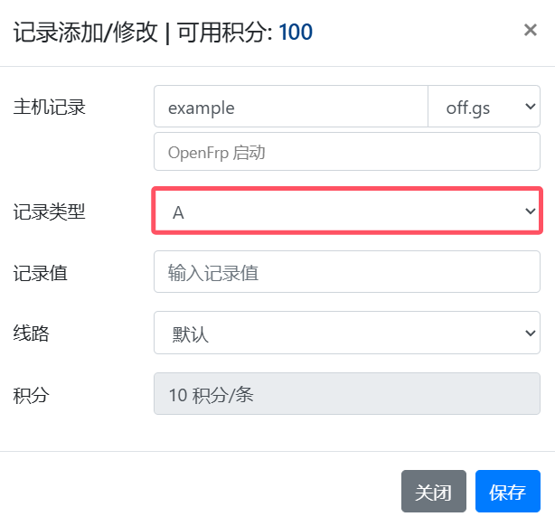
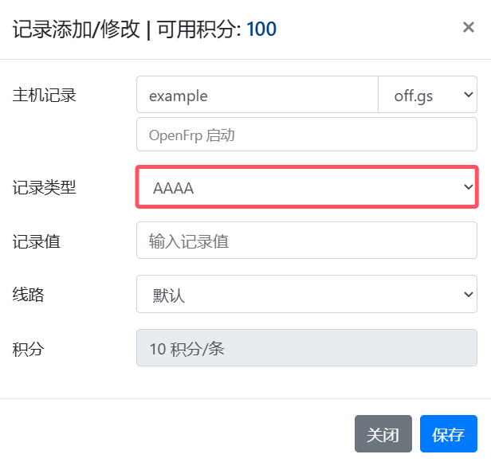
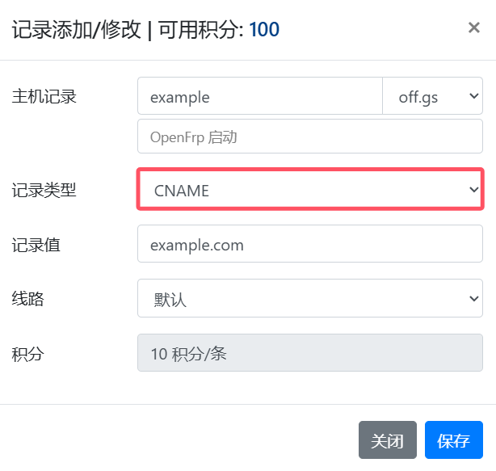
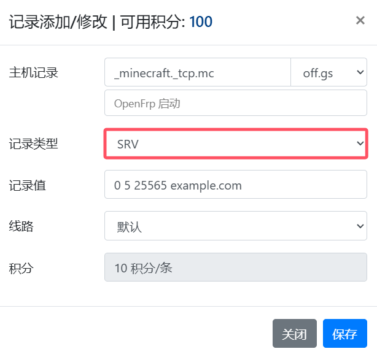
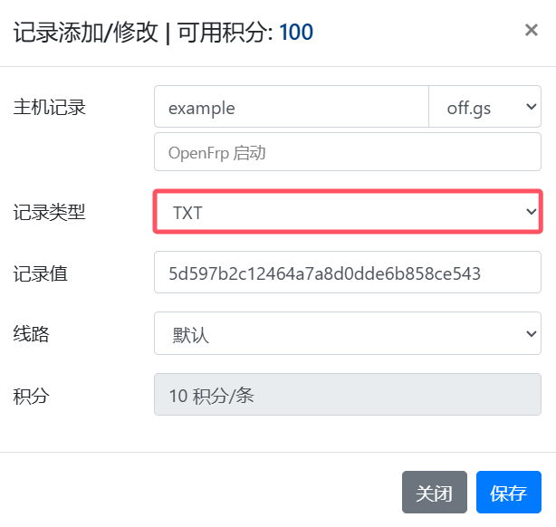

# 使用Natayark免费域名

:::tip 没有免费的域名？我们提供

- 免费的二级域名分发
- 免费的DNS解析服务

欢迎使用[Natayark免费域名](https://dns.17a.gs)
:::

## 获取域名

打开[Natayark免费域名](https://dns.17a.gs)输入你想获取的域名（后缀选择 `off.gs`）

查询结果若为 **可用**，你就可以使用这个域名绑定你的服务了  
点击 **解析** 并登录你的Natayark账号，[添加解析记录](#添加解析记录)即可

## 添加解析记录

### 解析记录类型

Natayark免费域名提供的解析记录包含：

- [A记录](#a记录)
- [AAAA记录](#aaaa记录)
- [CNAME记录](#cname记录)
- [SRV记录](#srv记录)
- [TXT记录](#txt记录)

### A记录

#### 使用场景

添加 A 记录可实现将域名指向 IPv4 地址

#### 设置方法

1.登录[Natayark域名分发控制台](https://dns.17a.gs/home)

2.在 **解析记录** 页面，单击 **添加** 按钮

3.添加会话框中各项参数的添加说明

- **主机记录**：一般是指子域名的前缀（如需创建子域名为 `example.off.gs`, **主机记录** 输入 `example`），后方的 **选择框** 选择 `off.gs`
- **记录类型**：选择 **A**
- **记录值**：记录值为IP地址，填写 IPv4 地址
- **线路**：默认

### AAAA记录

#### 使用场景

当预期是实现访问者通过 IPv6 地址访问网站，可以使用 AAAA 记录实现

#### 设置方法

1.登录[Natayark域名分发控制台](https://dns.17a.gs/home)

2.在 **解析记录** 页面，单击 **添加** 按钮

3.添加会话框中各项参数的添加说明

- **主机记录**：一般是指子域名的前缀（如需创建子域名为 `example.off.gs`, **主机记录** 输入 `example`），后方的 **选择框** 选择 `off.gs`
- **记录类型**：选择 **AAAA**
- **记录值**：记录值为IP地址，填写 IPV6 地址
- **线路**：默认

### CNAME记录

#### 使用场景

当需要将域名指向另一个域名，再由另一个域名提供 IP 地址，就需要添加 CNAME 记录，最常用到 CNAME 的场景包括做 CDN、设置 HTTP(S) 隧道解析等

#### 设置方法

1.登录[Natayark域名分发控制台](https://dns.17a.gs/home)

2.在 **解析记录** 页面，单击 **添加** 按钮

3.添加会话框中各项参数的添加说明

- **主机记录**：一般是指子域名的前缀（如需创建子域名为 `example.off.gs`, **主机记录** 输入 `example`），后方的 **选择框** 选择 `off.gs`
- **记录类型**：选择 **CNAME**
- **记录值**：记录值为 CNAME 指向的域名，只可以填写域名。本示例填写 `example.com`
- **线路**：默认

### SRV记录

#### 使用场景

SRV 记录用来标识某台服务器使用了某个服务，常见于Minecraft服务器访问配置

#### 设置方法

1.登录[Natayark域名分发控制台](https://dns.17a.gs/home)

2.在 **解析记录** 页面，单击 **添加** 按钮

3.添加会话框中各项参数的添加说明

- **主机记录**：格式为 **服务的名字**.**协议的类型**.**子域名的前缀** 例如：`_minecraft._tcp.mc`。后方的 **选择框** 选择`off.gs`
- **记录类型**：选择 **SRV**
- **记录值**：格式为 **优先级** **权重** **端口** **目标地址** ，每项中间需以空格分隔 例如：`0 5 25565 example.com`
- **线路**：默认

### TXT记录

#### 使用场景

如果希望对域名进行标识和说明，可以使用 TXT 记录， TXT 记录多用来做数字认证证书、SPF 记录（反垃圾邮件）

#### 设置方法

1.登录[Natayark域名分发控制台](https://dns.17a.gs/home)

2.在 **解析记录** 页面，单击 **添加** 按钮

3.添加会话框中各项参数的添加说明

- **主机记录**：一般是指子域名的前缀（如需为子域名为 `example.off.gs`添加TXT记录, **主机记录** 输入 `example`），后方的 **选择框** 选择 `off.gs`
- **记录类型**：选择 **TXT**
- **记录值**：常用情况 TXT 记录是用来做验证类的操作，比如托管子域名时需要添加TXT记录验证，记录值：`5d597b2c12464a7a8d0dde6b858ce543`
- **线路**：默认

