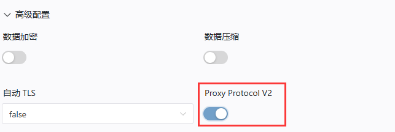

# 前文提要

安全在于你的数据之中，也许是一次家庭合照，或者你的密码集合。

若不做任何措施,必有小贼无所事事。

- 对于暴露在网络上的任何东西，密码一定要足够强
- 保持谦逊是美德，也是保护您不被人攻击的隐身咒
- 如果您知道一个东西以漏洞闻名，那就为它多加防护
- 如果没有特殊需求，使用最新版程序通常都是一个好选择
- 尤其是当您使用诸如 WordPress 这类历史悠久的项目时，您遇到陈年老代码带来漏洞的可能性将急速升高
- 请务必打开各个程序自带的更新检测，并总在第一时间进行更新

## 获取访问者的真实 IP

也许您会将 FRP 用在映射您的网站服务，大概率也可能带着 账户登录。

正常的 FRP 映射不需要进行如题操作，而账户操作大部分情况需要获取访问者真实 IP (避免盗号操作)。

目前，可用的方案有如下两种。
- X-Forwarded-For 访问头
- Proxy Protocol

您需要根据您穿透的本地服务选用合适的方案。

### XFF 请求头

::: warning该方案仅适用于 HTTP 隧道，不适用于 HTTPS、TCP、UDP 等隧道，所以推荐方案 2 :::

使用 HTTP 隧道时，FRPC 会自动将客户端的请求 IP 追加到 X-Forwarded-For 尾部，您的应用程序可以通过读取这两个请求头来获取客户端真实 IP。您可以参考 [MDN 文档](https://developer.mozilla.org/zh-CN/docs/Web/HTTP/Headers/X-Forwarded-For) 获取更多信息。

请注意，XFF 头的前半部分是 用户完全可控 的，因此 前面的数据并不可靠。我们推荐您只读取最后一个 IP，并且总是做好数据过滤以防出现安全问题。

``` 
# 格式说明
X-Forwarded-For: <client>, <proxy1>, ...,<连接到 FRPC 的 IP>

# 例如:
X-Forwarded-For: 127.0.0.1
X-Forwarded-For: 127.0.0.1; openfrp , 114.51.4.191 , 114.114.114.114
```

### Proxy Protocol

::: warning
使用该方案时必须在本地服务也做相应的配置，只修改 FRP 配置会造成 隧道完全不可用。
:::

Proxy Protocol 是由 HAProxy 开发者 Willy 提出的一种反向代理协议，目前已被广泛支持。您可以参考 [HAProxy 文档](http://www.haproxy.org/download/1.8/doc/proxy-protocol.txt) 获取更多信息。

在隧道配置中设定 **高级设置** 并启用 `Proxy Protocol V2` 后，FRPC 就会在请求本地服务时应用 HAProxy 协议：


注：通过此开关启用的 Proxy Protocol 默认是 v2版本。

若程序仅支持 v1 版本的 Proxy Protocol ，请手动添加配置文件。同样的，也可以通过此功能手动添加Proxy Protocol v2 的有关配置。
```
transport.proxyProtocolVersion = "v1|v2"
```

Proxy Protocol 有两个版本：v1 和 v2，请先调查您所使用的本地服务支持哪个版本再进行配置。如果两个版本都支持的，我们推荐您使用 v2 以提高传输效率。

